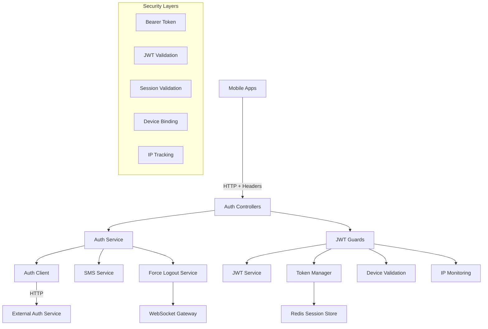
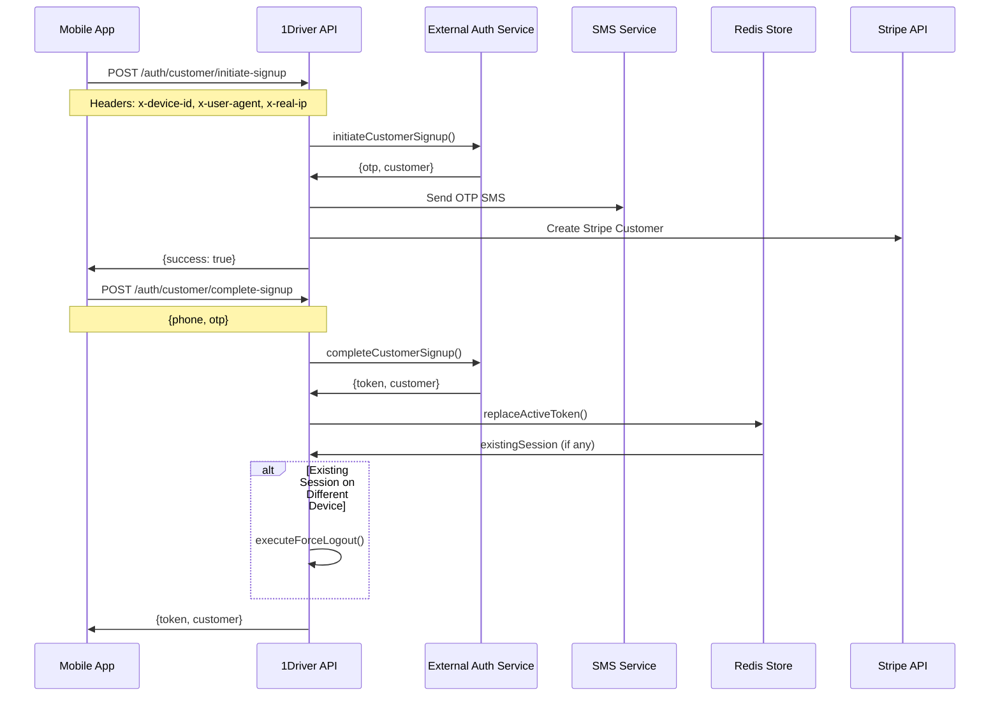
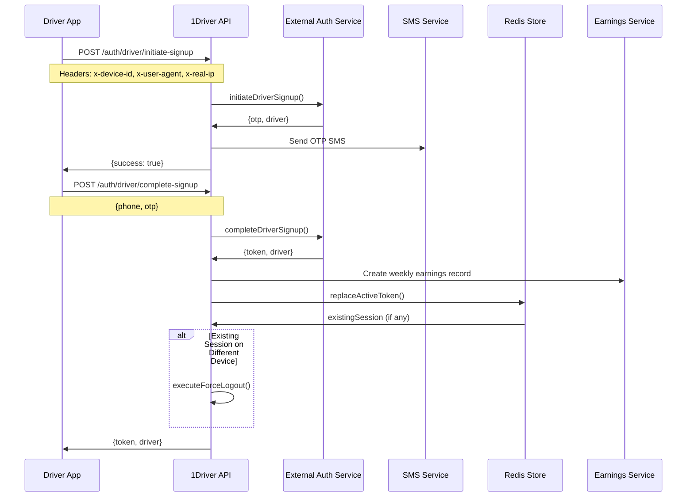
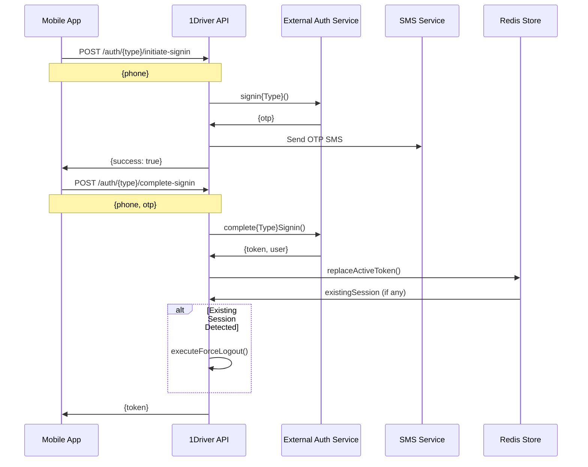
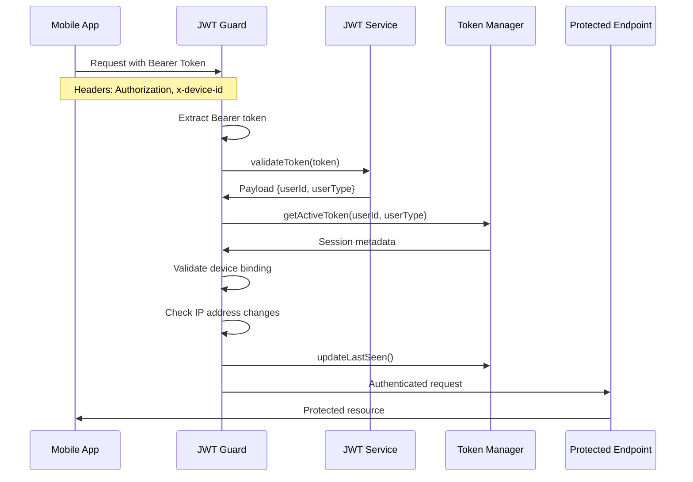

# 🔐 Authentication System - 1Driver Main API

## 📋 Table of Contents
1. [System Architecture](#-system-architecture)
2. [Authentication Flows](#-authentication-flows)
3. [API Reference](#-api-reference)
4. [Security Implementation](#-security-implementation)
5. [Integration Guide](#-integration-guide)
6. [Security Features](#-security-features)

## 🏗️ System Architecture

### High-Level Authentication Architecture


### Component Architecture

#### **Authentication Client Layer** (`src/clients/auth/`)
- **Purpose**: Proxy to external authentication service
- **Pattern**: HTTP client wrapper with retry logic and connection pooling
- **Responsibilities**:
  - Customer and driver registration/sign-in flows
  - OTP validation and token generation
  - Error handling and request transformation

#### **Authentication Module** (`src/modules/auth/`)
- **Purpose**: Business logic orchestration and integration
- **Components**:
  - **Controllers**: HTTP endpoint handlers for customer/driver flows
  - **Services**: Business logic, SMS integration, Stripe customer creation
  - **Force Logout**: Multi-device session management

#### **JWT Security Layer** (`src/jwt/`)
- **Purpose**: Token validation and session security
- **Components**:
  - **JWT Service**: Token validation and decoding
  - **HTTP Guards**: Request authentication for REST endpoints
  - **WebSocket Guards**: Real-time connection authentication
  - **Session Management**: Redis-based session storage with device binding

## 🔄 Authentication Flows

### Customer Registration Flow


### Driver Registration Flow


### Sign-In Flow (Customer & Driver)


### Request Authentication Flow


## 📚 API Reference

### Customer Authentication Endpoints

#### **Initiate Customer Registration**
```http
POST /auth/customer/initiate-signup
Content-Type: application/json
x-device-id: uuid-string
x-user-agent: app-info
x-real-ip: client-ip
```

**Request Body:**
```typescript
{
  name: string;           // First name (required)
  surname: string;        // Last name (required)
  phone: string;          // Phone with country code (required)
  email: string;          // Email address (required)
  vehicle: {              // Vehicle information (required)
    transmissionType: 'manual' | 'automatic';
    licensePlate: string;
  };
  dateOfBirth?: string;   // ISO date string (optional)
  expoToken?: string;     // Push notification token (optional)
}
```

**Response (201):**
```json
{
  "success": true,
  "message": "OTP sent successfully"
}
```

**Errors:**
- `409` - Customer already exists
- `400` - Invalid phone number or validation error
- `500` - Internal server error

#### **Complete Customer Registration**
```http
POST /auth/customer/complete-signup
Content-Type: application/json
x-device-id: uuid-string
x-user-agent: app-info
x-real-ip: client-ip
```

**Request Body:**
```typescript
{
  phone: string;  // Phone number (required)
  otp: string;    // 6-digit OTP code (required)
}
```

**Response (200):**
```json
{
  "token": "eyJhbGciOiJIUzI1NiIsInR5cCI6IkpXVCJ9...",
  "customer": {
    "_id": "user-id",
    "name": "John",
    "surname": "Doe",
    "email": "john@example.com",
    "phone": "+1234567890"
  }
}
```

#### **Customer Sign-In (Initiate)**
```http
POST /auth/customer/initiate-signin
Content-Type: application/json
```

**Request Body:**
```typescript
{
  phone: string;  // Phone number (required)
}
```

**Response (200):**
```json
{
  "success": true,
  "message": "OTP sent successfully",
  "otp": "123456"  // Only in development mode
}
```

#### **Customer Sign-In (Complete)**
```http
POST /auth/customer/complete-signin
Content-Type: application/json
x-device-id: uuid-string
x-user-agent: app-info
x-real-ip: client-ip
```

**Request Body:**
```typescript
{
  phone: string;  // Phone number (required)
  otp: string;    // 6-digit OTP code (required)
}
```

**Response (200):**
```json
{
  "token": "eyJhbGciOiJIUzI1NiIsInR5cCI6IkpXVCJ9..."
}
```

#### **Resend Customer OTP**
```http
POST /auth/customer/resend-otp
Content-Type: application/json
```

**Request Body:**
```typescript
{
  phone: string;  // Phone number (required)
}
```

#### **Customer Logout**
```http
POST /auth/customer/logout
Authorization: Bearer {token}
```

**Response (200):**
```json
{
  "success": true,
  "message": "Logged out successfully"
}
```

### Driver Authentication Endpoints

Driver endpoints follow the same pattern as customer endpoints:
- `POST /auth/driver/initiate-signup`
- `POST /auth/driver/complete-signup`
- `POST /auth/driver/initiate-signin`
- `POST /auth/driver/complete-signin`
- `POST /auth/driver/resend-otp`
- `POST /auth/driver/logout`

**Key Differences:**
- Driver registration creates initial earnings record

### Required Headers

#### **Device Information Headers**
- `x-device-id`: Unique device identifier
- `x-user-agent`: Application and device information
- `x-real-ip` / `x-forwarded-for`: Client IP address for security tracking

#### **Authentication Headers**
- `Authorization: Bearer {jwt-token}`: Required for protected endpoints

### HTTP Status Codes

| Code | Description |
|------|-------------|
| `200` | Success |
| `201` | Resource created successfully |
| `400` | Bad request - validation error |
| `401` | Unauthorized - invalid token |
| `403` | Forbidden - device mismatch |
| `404` | User not found |
| `409` | Conflict - user already exists |
| `500` | Internal server error |

## 🔒 Security Implementation

### JWT Token Structure

#### **Token Payload**
```typescript
interface IJwtPayload {
  userId: string;     // Unique user identifier
  userType: UserType; // 'CUSTOMER' | 'DRIVER'
  email?: string;     // Optional email field
  iat: number;        // Issued at timestamp
  exp: number;        // Expiration timestamp (30 days default)
}
```

#### **Token Configuration**
- **Algorithm**: HS256 (configurable)
- **Expiration**: 2,592,000 seconds (30 days)
- **Secret**: Environment variable `JWT_SECRET`
- **Issuer**: 1Driver API

### Multi-Layer Security Validation

#### **HTTP Request Validation (JwtGuard)**
1. **Bearer Token Extraction**: From `Authorization: Bearer <token>` header
2. **JWT Token Validation**: Signature and expiration check
3. **Session Cross-Reference**: Validate against Redis session store
4. **Device Binding Check**: Compare device ID with stored session
5. **IP Address Monitoring**: Track and log IP changes for security
6. **Activity Update**: Update last-seen timestamp and IP

#### **WebSocket Connection Validation (WsJwtGuard)**
1. **Multiple Token Sources**: Auth object, query params, headers
2. **Mandatory Device ID**: Required for WebSocket connections
3. **Session Cross-Validation**: Verify token matches active session
4. **Real-time Disconnect**: Immediately disconnect invalid connections
5. **Error Messaging**: Specific failure reasons sent to client

### Device Binding Implementation

#### **Device Information Collection**
```typescript
interface DeviceInfo {
  deviceId: string;     // Primary identifier (mandatory)
  platform?: string;   // iOS, Android, Web
  osVersion?: string;   // Operating system version
  appVersion?: string;  // Application version
  model?: string;       // Device model
}
```

#### **Binding Validation Logic**
```typescript
private validateDeviceBinding(currentDevice: any, sessionMetadata: any): boolean {
  // Primary validation: Device ID (strict)
  if (currentDevice.deviceId && sessionMetadata.deviceId) {
    return currentDevice.deviceId === sessionMetadata.deviceId;
  }
  return false; // No fallback - strict device binding
}
```

#### **Session Metadata Structure**
```typescript
interface SessionMetadata {
  token: string;           // The JWT token
  deviceId: string;        // Device identifier
  deviceInfo?: DeviceInfo; // Device details
  ipAddress?: string;      // IP address tracking
  userAgent?: string;      // Browser/app fingerprint
  createdAt: string;       // Session creation time
  lastSeenAt: string;      // Last activity timestamp
  isActive: boolean;       // Session status
}
```

### Single Session Enforcement

#### **Session Replacement Process**
1. **Atomic Operation**: `replaceActiveToken()` ensures data consistency
2. **Previous Session Detection**: Checks for existing active sessions
3. **Force Logout Trigger**: Automatically logs out previous sessions
4. **Device Notification**: Notifies affected devices about logout
5. **Event Emission**: Publishes authentication events for other systems

#### **Force Logout System**
```typescript
// Force logout event types
enum ForceLogoutReason {
  NEW_DEVICE_SIGNIN = 'new_device_signin',
  NEW_DEVICE_SIGNUP = 'new_device_signup',
  MANUAL_LOGOUT = 'manual_logout',
  SECURITY_BREACH = 'security_breach'
}
```

### Redis Session Management

#### **Key Patterns**
- **Active Token**: `auth:user:active_token:{userType}:{userId}`
- **Session Activity**: `auth:user:session_activity:{userType}:{userId}`
- **WebSocket Connection**: `ws:user:active_socket:{userType}:{userId}`

#### **Session Operations**
- **`getActiveToken()`**: Retrieves current session metadata
- **`replaceActiveToken()`**: Atomically replaces existing sessions
- **`updateLastSeen()`**: Updates activity timestamp and IP
- **`invalidateToken()`**: Removes session from Redis store

#### **Expiration Management**
- **Token Expiry Buffer**: 60-second buffer beyond JWT expiration
- **TTL Maintenance**: Preserves Redis TTL during updates
- **Automatic Cleanup**: Redis handles expired session removal

## 🔗 Integration Guide

### External Service Dependencies

#### **SMS Service Integration**
```typescript
// SMS configuration for OTP delivery
{
  messageType: MessageType.OTP,
  message: 'OTP Verification',
  mobileNumber: phone,
  otpCode: otp
}
```

#### **Stripe Integration (Customer Registration)**
```typescript
// Automatic Stripe customer creation
await paymentsService.createStripeCustomer(customerId, {
  name: `${customer.name} ${customer.surname}`,
  email: customer.email,
  phone: customer.phone
});
```

#### **Driver Earnings Integration**
```typescript
// Initial earnings record creation
await driverEarningsService.findOrCreateCurrentWeekRecord(driverId);
```

### Phone Number Validation

#### **Supported Countries (17 countries)**
```typescript
const ALLOWED_COUNTRIES = [
  'TR', 'US', 'GB', 'DE', 'FR', 'IT', 'ES', 'NL', 
  'BE', 'AT', 'CH', 'SE', 'NO', 'DK', 'FI', 'PL', 'AU'
];
```

#### **Validation Rules**
- **Format**: E.164 international format
- **Library**: `libphonenumber-js` for validation
- **Development Bypass**: Validation bypassed in development mode

### Environment Configuration

#### **JWT Configuration**
```env
JWT_SECRET=your-super-secret-jwt-key
JWT_EXPIRES_IN=2592000  # 30 days in seconds
```

#### **External Service URLs**
```env
AUTH_SERVICE_URL=https://auth-service.example.com
SMS_SERVICE_URL=https://sms-service.example.com
```

## 🛡️ Security Features

### Threat Mitigation

#### **Token Security**
- **Long-lived Tokens**: 30-day expiration for mobile convenience
- **Device Binding**: Prevents token reuse across devices
- **Session Validation**: Every request validates against Redis store
- **Automatic Logout**: Forces logout on device changes

#### **IP Address Monitoring**
```typescript
// IP change detection and logging
if (sessionMetadata.ipAddress && sessionMetadata.ipAddress !== currentIpAddress) {
  logger.warn('IP address change detected', {
    userId,
    userType,
    oldIP: sessionMetadata.ipAddress,
    newIP: currentIpAddress
  });
  await tokenManagerService.updateLastSeen(userId, userType, currentIpAddress);
}
```

#### **Comprehensive Audit Logging**
- **Failed Authentication**: Invalid tokens, device mismatches
- **Session Events**: Creation, replacement, logout events
- **Security Violations**: IP changes, unauthorized access attempts
- **Device Changes**: New device logins and forced logouts

### WebSocket Security

#### **Connection Authentication**
```javascript
// WebSocket authentication flow
socket.emit('authenticate', {
  token: 'jwt_token',
  deviceId: 'device_identifier'
});

// Authentication responses
socket.on('auth_success', (data) => {
  // Authenticated successfully
});

socket.on('auth_failed', (data) => {
  // Authentication failed with specific reason
  console.log(data.reason); // 'invalid_token', 'device_mismatch', etc.
});
```

#### **Real-time Validation**
- **Every Message**: Token validation on each WebSocket message
- **Device Verification**: Continuous device ID validation
- **Force Disconnect**: Immediate disconnection on validation failure
- **Error Messaging**: Detailed failure reasons for debugging

### Event-Driven Architecture

#### **Authentication Events**
```typescript
// Published authentication events
enum AuthEvent {
  FORCE_LOGOUT_REQUESTED = 'auth.forceLogout.requested',
  FORCE_LOGOUT_COMPLETED = 'auth.forceLogout.completed',
  WEBSOCKET_LOGOUT = 'auth.websocket.logout',
  MANUAL_LOGOUT = 'auth.manual.logout'
}
```

#### **Event Payloads**
```typescript
interface ForceLogoutEvent {
  userId: string;
  userType: UserType;
  reason: ForceLogoutReason;
  oldDeviceId: string;
  newDeviceId: string;
  metadata: {
    ipAddress: string;
    userAgent: string;
    oldSessionInfo: SessionMetadata;
  };
}
```

### Error Handling Strategy

#### **Client Error Responses**
```typescript
// Standard error response format
{
  "error": {
    "code": "AUTH_ERROR_CODE",
    "message": "Human-readable error message",
    "details": {
      // Additional error context
    }
  }
}
```

#### **Common Error Scenarios**
- **Invalid OTP**: `400 Bad Request` with retry guidance
- **Expired Token**: `401 Unauthorized` with re-authentication required
- **Device Mismatch**: `403 Forbidden` with device binding explanation
- **Rate Limiting**: `429 Too Many Requests` with retry-after header

## 🔍 Troubleshooting

### Common Issues

#### **Device Mismatch Errors**
- **Cause**: Device ID header missing or different from session
- **Solution**: Ensure consistent `x-device-id` header across requests
- **Debug**: Check Redis session data for stored device ID

#### **Token Validation Failures**
- **Cause**: Expired tokens, invalid signatures, or missing sessions
- **Solution**: Re-authenticate user through sign-in flow
- **Debug**: Verify JWT secret configuration and Redis connectivity

#### **OTP Delivery Issues**
- **Cause**: SMS service failures or invalid phone numbers
- **Solution**: Check SMS service configuration and phone validation
- **Debug**: Monitor SMS service logs and phone number formatting

### Security Monitoring

#### **Key Metrics to Monitor**
- Failed authentication attempts per user/IP
- Device ID mismatches and patterns
- IP address change frequency
- Token validation failure rates
- OTP delivery success rates

#### **Alerting Thresholds**
- Multiple failed logins from same IP: > 5 per minute
- High device mismatch rate: > 10% of requests
- OTP delivery failures: > 5% failure rate
- Token validation errors: > 2% error rate

---

**1Driver Authentication System** provides enterprise-grade security with sophisticated device binding, single-session enforcement, and comprehensive threat detection capabilities. The multi-layer validation ensures secure access while maintaining user experience through long-lived tokens and seamless device management.