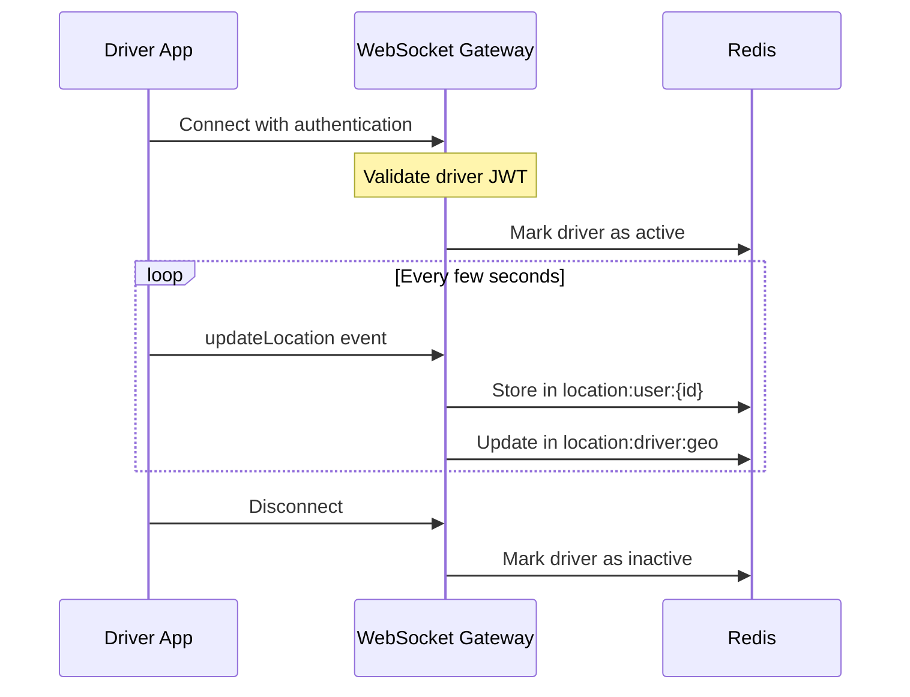
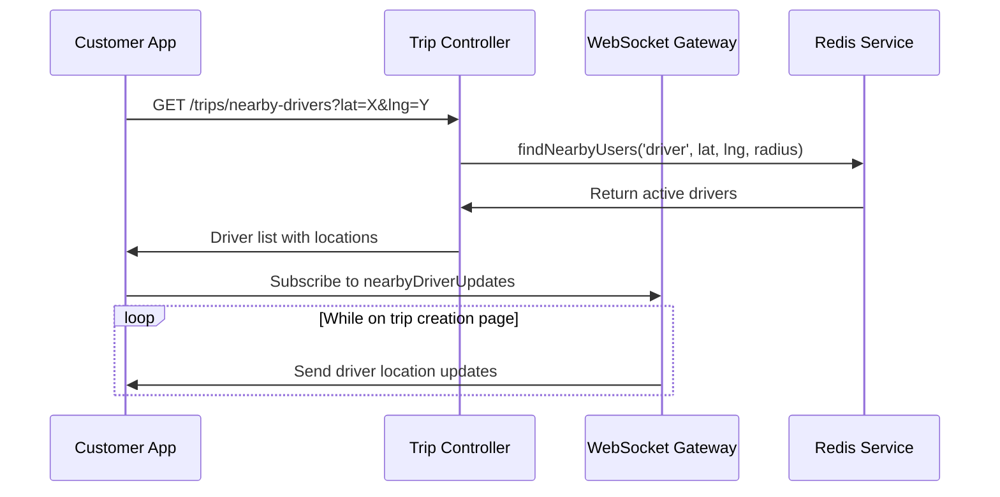
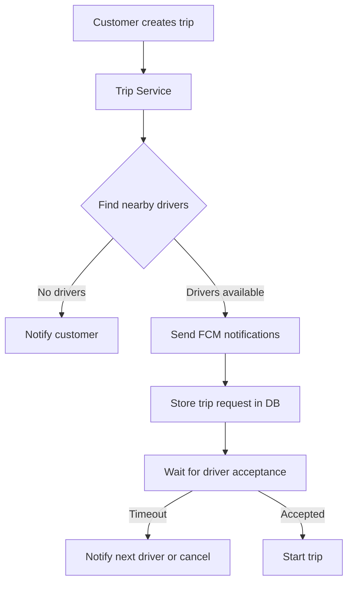
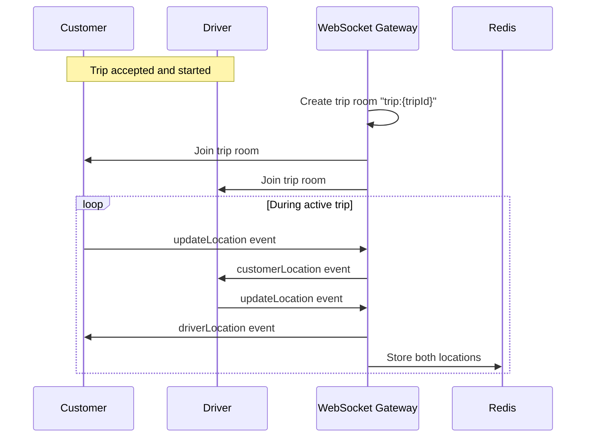
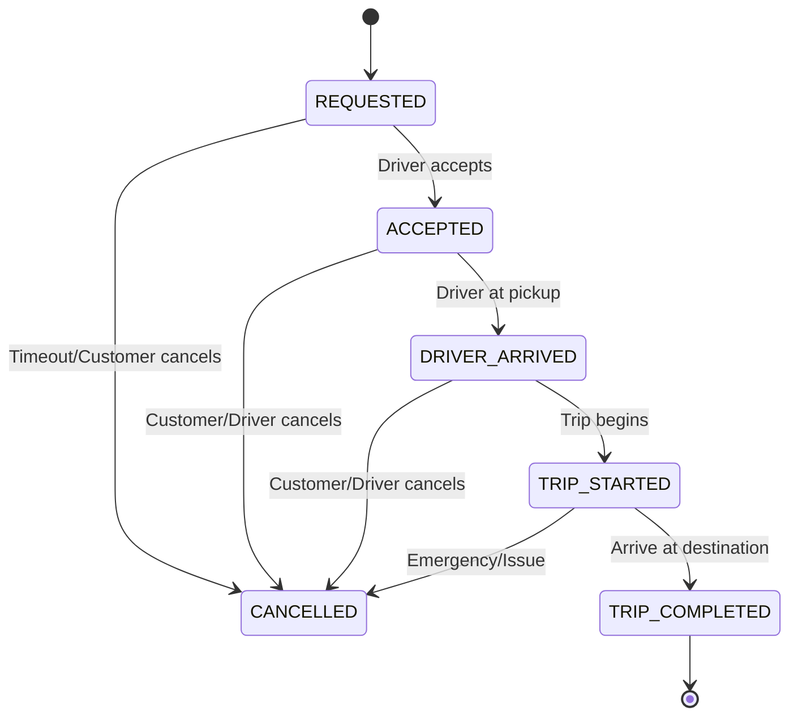

# Ride Sharing Uygulama Geliştirme Planı

## Mimari Diyagramlar

### 1. Sürücü Konum Takibi Akışı

### 2. Yakındaki Sürücüleri Bulma Akışı

### 3. Trip İsteği Bildirimi Akışı

### 4. Konum Paylaşımı Akışı

### 5. Trip Durum Değişiklikleri

## 1. Aktif Sürücü Konum Takibi 🚗
- [x] Sürücü konum bilgilerini Redis'e kaydetme
- [x] Sürücü aktiflik durumu için Redis yapısı
- [x] WebSocket ile konum güncellemelerini alma
- [x] Sürücü müsaitlik durumu kontrolü

## 2. Yakındaki Sürücüleri Gösterme 🗺️
- [x] Trip oluşturma ekranında müşteriye yakın sürücüleri listeleme
- [x] Redis Geo fonksiyonları ile yakındaki sürücüleri bulma
- [x] Harita üzerinde sürücüleri gösterme
- [x] Gerçek zamanlı konum güncellemesi

## 3. FCM ile Trip İsteklerini İletme 📱
- [x] Firebase/FCM modülü oluşturma
- [x] FCM token yönetimi
- [x] Yakındaki sürücülere bildirim gönderme
- [x] Trip isteği oluşturma ve izleme

## 4. Konum Bilgisi Paylaşımı ↔️
- [x] Trip odası (room) oluşturma
- [x] Sürücü-müşteri arasında konum güncellemesi paylaşımı
- [x] Gerçek zamanlı konum takibi
- [x] WebSocket bağlantı yönetimi

## 5. Trip Durum Güncellemeleri 🔄
- [x] Trip durum enum'ları oluşturma
- [x] FCM ile durum değişikliklerini bildirme
- [x] Sürücü durum değişiklikleri (yola çıktı, varış noktasında, vb.)
- [x] Müşteri bilgilendirme bildirimleri

## Teknik Detaylar

### Aktif Sürücü Konum Takibi
- Redis'te `driver:active:{driverId}` anahtarı ile aktif sürücüleri izleme
- Konum bilgilerini `location:user:{userId}` ve `location:driver:geo` setlerinde saklama
- Sürücü uygulamasından düzenli konum güncellemeleri alma (WebSocket)
- Sürücü durumunu (müsait, meşgul, çevrimdışı) takip etme

### Yakındaki Sürücüleri Gösterme
- Redis GEORADIUS komutu ile belirli bir yarıçaptaki sürücüleri bulma
- Trip oluşturma sayfasında harita entegrasyonu
- WebSocket üzerinden gerçek zamanlı konum güncellemeleri
- Müsait sürücüleri filtreleme

### FCM ile Trip İsteklerini İletme
- Firebase Admin SDK entegrasyonu
- Sürücü ve müşteri FCM token yönetimi
- Trip isteği bildirimleri için FCM yapılandırması
- Bildirim tıklama işlemleri ve yönlendirme

### Konum Bilgisi Paylaşımı
- Trip eşleşmesi sonrası özel WebSocket odası oluşturma
- Konum güncellemelerini karşılıklı paylaşma
- Harita üzerinde gerçek zamanlı takip
- Bağlantı kopması durumunda yeniden bağlanma stratejisi

### Trip Durum Güncellemeleri
- Trip durumları: REQUESTED, ACCEPTED, DRIVER_ARRIVED, TRIP_STARTED, TRIP_COMPLETED, CANCELLED
- Her durum değişikliğinde FCM bildirimleri
- Durum değişikliklerini veritabanında kaydetme
- Müşteri ve sürücü arayüzlerinde durum gösterimi
