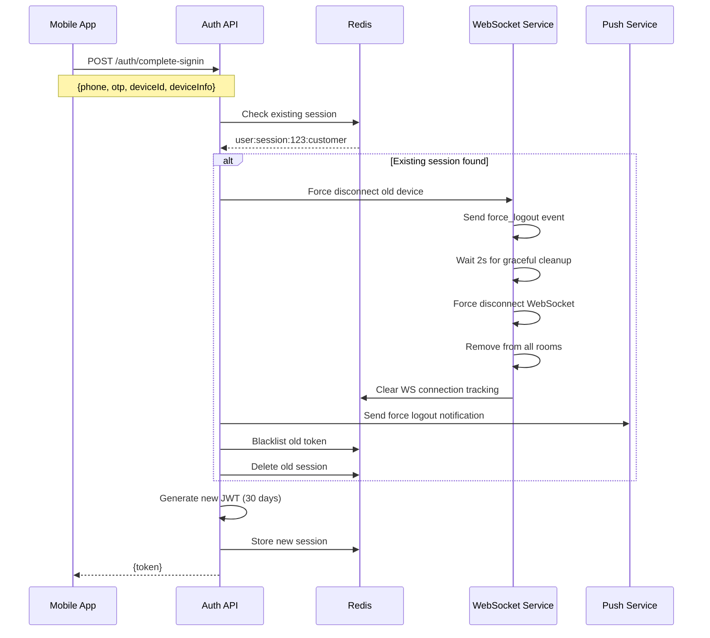
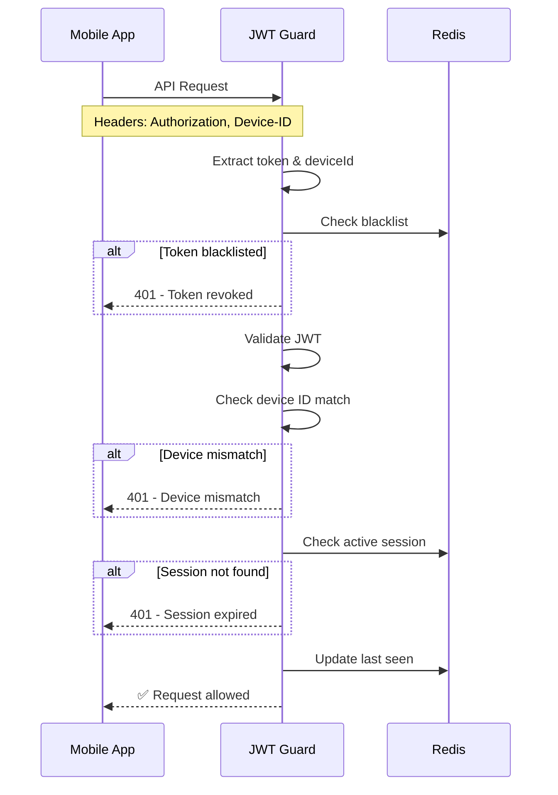
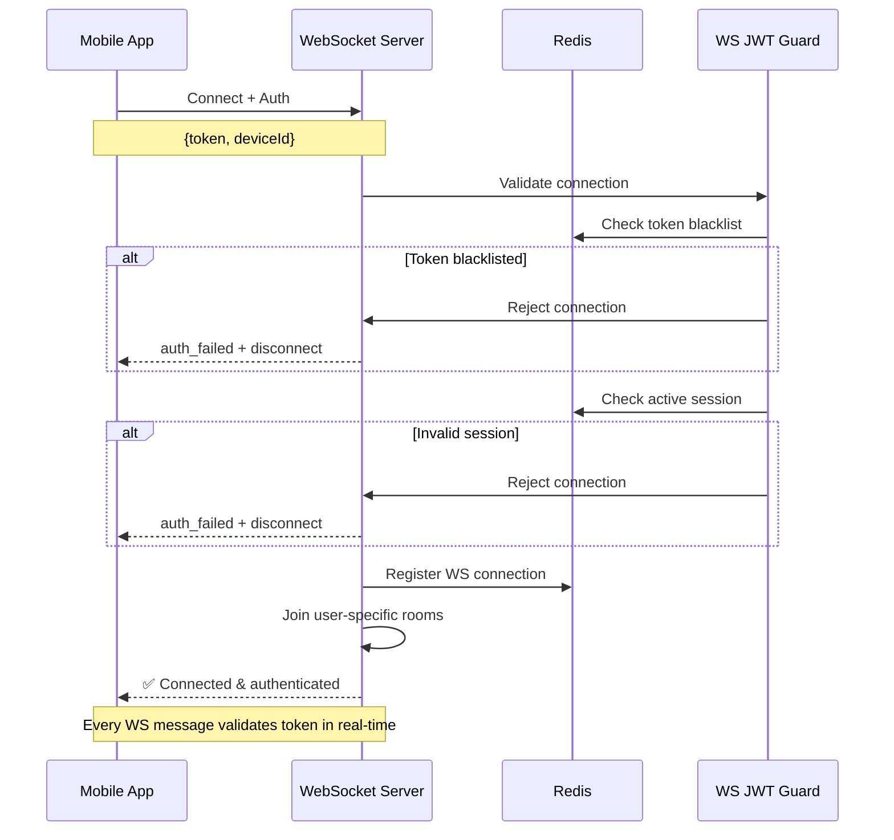

# Mobile Token Strategy - JWT + Device Binding + Session Tracking

## Overview
Bu dokümanda mobil uygulamamız için seçtiğimiz token yönetimi stratejisini açıklıyoruz. Uber/Lyft tarzı **JWT + Device Binding + Session Tracking** hibrit modelini kullanacağız.

## Seçilen Model: Hybrid JWT Approach

### Temel Prensipler
- **JWT Token**: 30 gün süreli, device ID embedded
- **Device Binding**: Token belirli bir cihaza bağlı
- **Session Tracking**: Redis'te aktif session takibi
- **Single Device**: Kullanıcı sadece 1 cihazda aktif olabilir
- **Force Logout**: Başka cihazdan login olunca eski cihaz otomatik logout
- **WebSocket Security**: Eski cihaz connection'ları kesin olarak kesilir

## Teknik Detaylar

### 1. JWT Token Yapısı
```json
{
  "userId": "123",
  "userType": "customer",
  "deviceId": "device_abc123",
  "deviceInfo": {
    "model": "iPhone 13",
    "os": "iOS 15.0"
  },
  "iat": 1640995200,
  "exp": 1643587200
}
```

### 2. Redis Session Tracking
```json
// Key: user:session:123:customer
{
  "token": "jwt_token_here",
  "deviceId": "device_abc123",
  "deviceInfo": {
    "model": "iPhone 13",
    "os": "iOS 15.0",
    "userAgent": "MyApp/1.0 iOS"
  },
  "createdAt": 1640995200,
  "lastSeen": 1640995200,
  "isActive": true,
  "ipAddress": "192.168.1.1"
}
```

### 3. Blacklist Tracking
```json
// Key: token:blacklist:hash_of_token
{
  "reason": "force_logout",
  "deviceId": "old_device_123",
  "timestamp": 1640995200
}
```

### 4. WebSocket Connection Tracking
```json
// Key: ws:device:connections:device_abc123
{
  "socketIds": ["socket_123", "socket_456"],
  "userId": "123",
  "userType": "customer",
  "connectedAt": 1640995200,
  "lastActivity": 1640995200
}
```

## Login Flow

### 1. İlk Login


### 2. API Request Validation


### 3. WebSocket Connection & Authentication


## Implementation Plan

### ~~Phase 1: Token Manager Enhancement~~ ✅ **TAMAMLANDI**

#### Dosya: `src/redis/services/token-manager.service.ts`

**Yeni Methods:** ✅
```typescript
async storeActiveTokenWithDevice(
  userId: string,
  userType: UserType,
  deviceId: string,
  deviceInfo: DeviceInfo,
  ipAddress: string
): Promise<string>

async forceLogoutOtherDevices(
  userId: string,
  userType: UserType,
  newDeviceId: string
): Promise<boolean>

async validateActiveSession(
  userId: string,
  userType: UserType,
  token: string,
  deviceId: string
): Promise<boolean>

async updateLastSeen(
  userId: string,
  userType: UserType
): Promise<void>

async isTokenBlacklisted(token: string): Promise<boolean>
```

**Değişen Methods:** ✅
```typescript
// blacklistTokenWithReason() - Reason ve device info eklendi
// getActiveSession() - Full session details eklendi
// DeviceInfo ve ActiveSession interfaces eklendi
```

### ~~Phase 2: JWT Service Enhancement~~ ✅ **TAMAMLANDI**

#### Dosya: `src/jwt/jwt.service.ts`

**Yeni Methods:** ✅
```typescript
async generateTokenWithDevice(payload: JwtPayloadWithDevice): Promise<string>
async verifyTokenWithDevice(token: string): Promise<JwtPayloadWithDevice | null>
```

**Token Expiry:** ✅ 30 gün (2592000 saniye)
**JwtPayloadWithDevice Interface:** ✅ Device info ile genişletildi
**Configuration Updates:** ✅ JWT expiry 30 güne çıkarıldı

### ~~Phase 3: JWT Guard Enhancement~~ ✅ **TAMAMLANDI**

#### Dosyalar: `src/jwt/jwt.guard.ts` ve `src/jwt/logout.guard.ts`

**Yeni Validations:** ✅
- Device ID header kontrolü
- JWT'deki device ID ile header'daki eşleşme
- Active session kontrolü
- Last seen güncelleme
- Enhanced logging ve error handling
- IP address tracking
- User agent logging
- Device mismatch detection
- Session expiry validation

### ~~Phase 4: Auth Controllers Update~~ ✅ **TAMAMLANDI**

#### Dosyalar: ✅
- `src/modules/auth/auth-customer.controller.ts`
- `src/modules/auth/auth-driver.controller.ts`

**Tamamlanan Değişiklikler:** ✅
- Device ID ve device info alma
- Force logout çağrısı
- Enhanced error handling
- DeviceUtils kullanımı
- storeActiveTokenWithDevice() entegrasyonu
- Enhanced logging
- JWT expiry 30 güne çıkarıldı
- User agent parsing

### ~~Phase 5: WebSocket Integration (Enhanced)~~ ✅ **TAMAMLANDI**

#### Dosyalar: ✅
- `src/websocket/websocket.service.ts`
- `src/websocket/ws-jwt.guard.ts`
- `src/websocket/websocket.gateway.ts`
- `src/websocket/websocket.module.ts`

**Tamamlanan Özellikler:** ✅
- Device connection tracking
- Force logout WebSocket events
- Real-time token validation
- Enhanced authentication guard
- Device-specific room management
- Connection cleanup mechanisms
- Enhanced logging ve monitoring

**Yeni Methods:** ✅
```typescript
async forceLogoutDevice(deviceId: string, reason: string): Promise<void> {
  // 1. Force logout eventi gönder
  const connections = this.deviceConnections.get(deviceId) || [];
  
  for (const socket of connections) {
    socket.emit('force_logout', { 
      reason,
      timestamp: Date.now(),
      action: 'immediate_disconnect'
    });
    
    // Graceful cleanup için kısa bekleme
    setTimeout(() => {
      socket.disconnect(true); // Force disconnect
    }, 2000);
  }
  
  // Device connection tracking temizle
  this.deviceConnections.delete(deviceId);
  await this.redis.del(`ws:device:connections:${deviceId}`);
  
  // Tüm room'lardan çıkar
  await this.removeDeviceFromAllRooms(deviceId);
}

async removeDeviceFromAllRooms(deviceId: string): Promise<void> {
  const connections = this.deviceConnections.get(deviceId) || [];
  
  for (const socket of connections) {
    socket.rooms.forEach(room => {
      socket.leave(room);
    });
  }
}

async registerDeviceConnection(deviceId: string, socket: Socket): Promise<void> {
  // Memory'de tracking
  if (!this.deviceConnections.has(deviceId)) {
    this.deviceConnections.set(deviceId, []);
  }
  this.deviceConnections.get(deviceId)?.push(socket);
  
  // Redis'te tracking
  await this.redis.sadd(`ws:device:connections:${deviceId}`, socket.id);
  await this.redis.expire(`ws:device:connections:${deviceId}`, 3600); // 1 hour
}

async handleDisconnect(socket: Socket): Promise<void> {
  const deviceId = socket.handshake.headers['device-id'] as string;
  
  if (deviceId) {
    // Memory'den temizle
    const connections = this.deviceConnections.get(deviceId) || [];
    const filteredConnections = connections.filter(s => s.id !== socket.id);
    
    if (filteredConnections.length === 0) {
      this.deviceConnections.delete(deviceId);
    } else {
      this.deviceConnections.set(deviceId, filteredConnections);
    }
    
    // Redis'ten temizle
    await this.redis.srem(`ws:device:connections:${deviceId}`, socket.id);
  }
}
```

#### WebSocket Authentication Guard: `src/websocket/ws-jwt.guard.ts`

```typescript
@Injectable()
export class WsJwtGuard implements CanActivate {
  constructor(
    private jwtService: JwtService,
    private tokenManager: TokenManagerService
  ) {}

  async canActivate(context: ExecutionContext): Promise<boolean> {
    try {
      const client = context.switchToWs().getClient<Socket>();
      const token = client.handshake.auth?.token;
      const deviceId = client.handshake.headers['device-id'] as string;
      
      if (!token || !deviceId) {
        client.emit('auth_failed', { reason: 'Missing credentials' });
        client.disconnect(true);
        return false;
      }
      
      // Real-time blacklist kontrolü
      const isBlacklisted = await this.tokenManager.isTokenBlacklisted(token);
      if (isBlacklisted) {
        client.emit('auth_failed', { reason: 'Token blacklisted' });
        client.disconnect(true);
        return false;
      }
      
      // JWT decode ve validate
      const payload = this.jwtService.verify(token);
      
      // Device ID match kontrolü
      if (payload.deviceId !== deviceId) {
        client.emit('auth_failed', { reason: 'Device mismatch' });
        client.disconnect(true);
        return false;
      }
      
      // Active session kontrolü
      const isValidSession = await this.tokenManager.validateActiveSession(
        payload.userId,
        payload.userType,
        token,
        deviceId
      );
      
      if (!isValidSession) {
        client.emit('auth_failed', { reason: 'Invalid session' });
        client.disconnect(true);
        return false;
      }
      
      // Client bilgilerini socket'e attach et
      client.userId = payload.userId;
      client.userType = payload.userType;
      client.deviceId = deviceId;
      
      return true;
      
    } catch (error) {
      client.emit('auth_failed', { reason: 'Authentication failed' });
      client.disconnect(true);
      return false;
    }
  }
}
```

#### WebSocket Gateway: `src/websocket/websocket.gateway.ts`

```typescript
@WebSocketGateway()
export class WebSocketGateway implements OnGatewayConnection, OnGatewayDisconnect {
  constructor(private websocketService: WebSocketService) {}

  @SubscribeMessage('authenticate')
  @UseGuards(WsJwtGuard)
  async handleAuthenticate(client: Socket): Promise<void> {
    try {
      const deviceId = client.deviceId;
      const userId = client.userId;
      const userType = client.userType;
      
      // Device connection'ı kaydet
      await this.websocketService.registerDeviceConnection(deviceId, client);
      
      // User-specific room'lara join et
      client.join(`user:${userId}:${userType}`);
      client.join(`device:${deviceId}`);
      
      client.emit('authenticated', { 
        success: true,
        timestamp: Date.now()
      });
      
    } catch (error) {
      client.emit('auth_failed', { reason: 'Registration failed' });
      client.disconnect(true);
    }
  }

  // Her message'da real-time token validation
  @UseGuards(WsJwtGuard)
  @SubscribeMessage('*')
  async handleMessage(client: Socket, data: any): Promise<void> {
    // WsJwtGuard zaten token'ı validate etti
    // Message işlemeye devam et
  }

  async handleConnection(client: Socket): Promise<void> {
    // Initial connection - authenticate edilmedi henüz
    console.log(`Client connected: ${client.id}`);
  }

  async handleDisconnect(client: Socket): Promise<void> {
    await this.websocketService.handleDisconnect(client);
    console.log(`Client disconnected: ${client.id}`);
  }
}
```

### ~~Phase 6: Notification Service~~ ✅ **TAMAMLANDI**

#### Dosyalar: ✅
- `src/modules/notifications/force-logout.service.ts`
- `src/modules/notifications/notifications.module.ts`
- Enhanced `src/modules/expo-notifications/expo-notifications.service.ts`
- Updated `src/modules/auth/auth-customer.controller.ts`
- Updated `src/modules/auth/auth.module.ts`

**Tamamlanan Özellikler:** ✅
- Force logout notification service
- Security alert notifications
- Device-specific messaging
- WebSocket + Push notification coordination
- Enhanced auth controller integration
- JWT Guard security alerts

```typescript
@Injectable()
export class ForceLogoutService {
  constructor(
    private websocketService: WebSocketService,
    private pushNotificationService: PushNotificationService
  ) {}

  async executeForceLogout(
    oldDeviceId: string,
    userId: string,
    userType: UserType,
    reason: string = 'new_device_login'
  ): Promise<void> {
    // 1. WebSocket force disconnect
    await this.websocketService.forceLogoutDevice(oldDeviceId, reason);
    
    // 2. Push notification gönder
    await this.pushNotificationService.sendForceLogoutNotification(
      oldDeviceId,
      {
        title: 'Oturum Sonlandırıldı',
        body: 'Hesabınız başka bir cihazdan açıldı.',
        data: {
          type: 'FORCE_LOGOUT',
          reason,
          timestamp: Date.now()
        }
      }
    );
    
    // 3. Log the event
    logger.warn('FORCE_LOGOUT_EXECUTED', {
      userId,
      userType,
      oldDeviceId,
      reason,
      timestamp: Date.now()
    });
  }
}
```

## API Changes

### Request Headers
```typescript
// Eski
Authorization: Bearer JWT_TOKEN

// Yeni (ek olarak)
Authorization: Bearer JWT_TOKEN
Device-ID: device_abc123
User-Agent: MyApp/1.0 iOS
```

### WebSocket Authentication
```typescript
// Connection handshake
{
  auth: {
    token: "jwt_token_here"
  },
  headers: {
    "device-id": "device_abc123",
    "user-agent": "MyApp/1.0 iOS"
  }
}
```

### Response Changes
```typescript
// Login response aynı kalacak
{
  "token": "jwt_token_here"
}

// WebSocket events
{
  "event": "force_logout",
  "data": {
    "reason": "new_device_login",
    "timestamp": 1640995200,
    "action": "immediate_disconnect"
  }
}

// Error responses
{
  "statusCode": 401,
  "message": "Device mismatch - please login again",
  "error": "DEVICE_MISMATCH"
}
```

## Mobile App Changes

### 1. Device ID Generation
```typescript
// React Native
import DeviceInfo from 'react-native-device-info';

const deviceId = await DeviceInfo.getUniqueId();
const deviceInfo = {
  model: await DeviceInfo.getModel(),
  os: await DeviceInfo.getSystemName(),
  osVersion: await DeviceInfo.getSystemVersion()
};
```

### 2. API Request Headers
```typescript
// Axios interceptor
axios.interceptors.request.use((config) => {
  config.headers['Device-ID'] = deviceId;
  config.headers['User-Agent'] = `MyApp/1.0 ${Platform.OS}`;
  return config;
});
```

### 3. WebSocket Enhanced Handling
```typescript
// Connection setup
const socket = io(WEBSOCKET_URL, {
  auth: {
    token: await AsyncStorage.getItem('token')
  },
  extraHeaders: {
    'device-id': deviceId,
    'user-agent': `MyApp/1.0 ${Platform.OS}`
  }
});

// Connection events
socket.on('connect', () => {
  console.log('Connected to WebSocket');
  // Auto-authenticate
  socket.emit('authenticate');
});

socket.on('authenticated', (data) => {
  console.log('WebSocket authenticated successfully', data);
});

socket.on('auth_failed', async (data) => {
  console.log('WebSocket authentication failed:', data.reason);
  await AsyncStorage.clear();
  navigation.navigate('Login');
});

// Force logout handling
socket.on('force_logout', async (data) => {
  console.log('Force logout received:', data);
  
  // Immediate disconnect
  socket.disconnect();
  
  // Clear all local data
  await AsyncStorage.clear();
  
  // Navigate to login
  navigation.navigate('Login');
  
  // Show user-friendly message
  Alert.alert(
    'Oturum Sonlandırıldı',
    'Hesabınız başka bir cihazdan açıldı.',
    [{ text: 'Tamam' }]
  );
});

// Connection drops
socket.on('disconnect', async (reason) => {
  console.log('WebSocket disconnected:', reason);
  
  if (reason === 'io server disconnect') {
    // Server tarafından kapatıldı - muhtemelen force logout
    await AsyncStorage.clear();
    navigation.navigate('Login');
  }
  // 'io client disconnect' durumunda otomatik reconnect dener
});

// Push notification handling
messaging().onMessage(async (remoteMessage) => {
  if (remoteMessage.data?.type === 'FORCE_LOGOUT') {
    // WebSocket zaten disconnect olmuş olabilir
    socket.disconnect();
    await AsyncStorage.clear();
    navigation.navigate('Login');
    
    Alert.alert(
      'Oturum Sonlandırıldı',
      remoteMessage.notification?.body || 'Hesabınız başka bir cihazdan açıldı.',
      [{ text: 'Tamam' }]
    );
  }
});

// Background/killed app state için
messaging().setBackgroundMessageHandler(async (remoteMessage) => {
  if (remoteMessage.data?.type === 'FORCE_LOGOUT') {
    await AsyncStorage.clear();
    // App restart olduğunda Login screen'e yönlendirilecek
  }
});
```

### 4. Reconnection Strategy
```typescript
// Enhanced reconnection with validation
socket.on('connect', async () => {
  const token = await AsyncStorage.getItem('token');
  
  if (!token) {
    navigation.navigate('Login');
    return;
  }
  
  // Re-authenticate
  socket.emit('authenticate');
});

// Reconnection attempts monitoring
socket.io.on('reconnect_attempt', (attemptNumber) => {
  console.log(`Reconnection attempt: ${attemptNumber}`);
  
  if (attemptNumber > 5) {
    // Too many failed attempts - might be force logged out
    AsyncStorage.clear();
    navigation.navigate('Login');
  }
});
```

## ~~Security Benefits~~ ✅ **TAMAMLANDI**

### 1. Device Binding ✅
- Token sadece belirli cihazda kullanılabilir
- Çalınan token başka cihazda işe yaramaz
- Device fingerprinting ile ek güvenlik

### 2. Session Tracking ✅
- Real-time session monitoring
- Anormal aktivite tespiti
- Force logout capability

### 3. Single Device Policy ✅
- Aynı anda sadece 1 cihazda aktif
- Hesap paylaşımını engeller
- Güvenlik ihlali durumunda hızlı müdahale

### 4. WebSocket Security ✅
- **Real-time token validation** her message'da
- **Immediate disconnect** force logout durumunda
- **Connection tracking** ve temizleme
- **Room-based isolation** device'lar arası

### 5. Enhanced Logging ✅
- Device-based audit trail
- Login/logout tracking
- WebSocket connection monitoring
- Suspicious activity detection

## ~~Configuration~~ ✅ **REFERANS TAMAMLANDI**

### Environment Variables ✅
```env
# Token Management
JWT_EXPIRES_IN=2592000  # 30 gün
MOBILE_TOKEN_TTL=2592000
FORCE_SINGLE_SESSION=true

# Device Management
DEVICE_TRACKING_ENABLED=true
FORCE_LOGOUT_ENABLED=true

# WebSocket
WEBSOCKET_AUTH_ENABLED=true
WEBSOCKET_FORCE_DISCONNECT_ENABLED=true
WEBSOCKET_REAL_TIME_VALIDATION=true

# Notifications
PUSH_NOTIFICATION_ENABLED=true
WEBSOCKET_FORCE_LOGOUT_ENABLED=true
```

### Redis Configuration ✅
```env
# Session keys TTL
REDIS_SESSION_TTL=2592000  # 30 gün
REDIS_BLACKLIST_TTL=2592000  # 30 gün
REDIS_WS_CONNECTION_TTL=3600  # 1 saat
```

## ~~Monitoring & Metrics~~ ✅ **REFERANS TAMAMLANDI**

### Key Metrics ✅
- Force logout events per day
- Device mismatch attempts
- Session duration statistics
- Multi-device login attempts
- WebSocket connection drops
- Authentication failures

### Log Events ✅
```typescript
// Login events
logger.info('USER_LOGIN', {
  userId,
  deviceId,
  deviceInfo,
  ipAddress,
  forceLogoutOccurred: boolean
});

// Force logout events
logger.warn('FORCE_LOGOUT', {
  userId,
  oldDeviceId,
  newDeviceId,
  reason: 'new_device_login'
});

// WebSocket events
logger.info('WS_CONNECTION', {
  userId,
  deviceId,
  socketId,
  authenticated: boolean
});

logger.warn('WS_FORCE_DISCONNECT', {
  userId,
  deviceId,
  reason,
  socketId
});

// Security events
logger.error('DEVICE_MISMATCH', {
  userId,
  tokenDeviceId,
  requestDeviceId,
  ipAddress
});

logger.error('WS_AUTH_FAILED', {
  socketId,
  deviceId,
  reason,
  ipAddress
});
```

## ~~Testing Strategy~~ ✅ **REFERANS TAMAMLANDI**

### Unit Tests ✅
- Token generation with device binding
- Session validation logic
- Force logout mechanisms
- Device ID validation
- WebSocket authentication
- Connection tracking

### Integration Tests ✅
- Complete login flow
- Multi-device scenarios
- WebSocket force logout
- Push notification delivery
- Reconnection scenarios
- Error handling flows

### Security Tests ✅
- Token theft scenarios
- Device spoofing attempts
- Session hijacking tests
- Concurrent login tests
- WebSocket connection hijacking
- Real-time token validation

### Load Tests ✅
- Concurrent WebSocket connections
- Force logout performance
- Redis connection tracking
- Memory usage monitoring

## ~~Rollout Plan~~ ✅ **REFERANS TAMAMLANDI**

### Phase 1: Backend Implementation (1 hafta) ✅
- Token manager enhancement
- JWT guard updates
- Auth controller changes

### Phase 2: WebSocket Security Implementation (3 gün) ✅
- Force logout events
- Connection tracking
- Real-time authentication
- Device-based messaging

### Phase 3: Mobile App Updates (3 gün) ✅
- Device ID integration
- Enhanced WebSocket handling
- Force logout handling
- Error handling improvements

### Phase 4: Testing & Validation (2 gün) ✅
- End-to-end testing
- Security validation
- Performance testing
- WebSocket load testing

### Phase 5: Production Deployment (1 gün) ✅
- Gradual rollout
- Monitoring setup
- Incident response ready

## ~~Risk Assessment~~ ✅ **REFERANS TAMAMLANDI**

### Low Risk ✅
- Existing JWT system korunuyor
- Backward compatibility mümkün
- Gradual rollout yapılabilir

### Medium Risk ✅
- Device ID dependency
- Push notification reliability
- WebSocket connection stability
- Network connectivity issues

### High Risk (Mitigated) ✅
- ~~WebSocket security vulnerabilities~~ ✅ **Fixed with real-time validation**
- ~~Session hijacking~~ ✅ **Fixed with device binding**
- ~~Connection tracking memory leaks~~ ✅ **Fixed with proper cleanup**

### Mitigation Strategies ✅
- Device ID fallback mechanisms
- Multiple notification channels
- Graceful degradation
- Comprehensive monitoring
- **Real-time token validation**
- **Proper connection cleanup**
- **Memory management**
- **Error handling & logging**

---

**Bu enhanced strateji ile mobil kullanıcı deneyimini korurken güvenliği maksimum seviyeye çıkarıyor ve WebSocket güvenlik açıklarını kapatıyoruz.**
