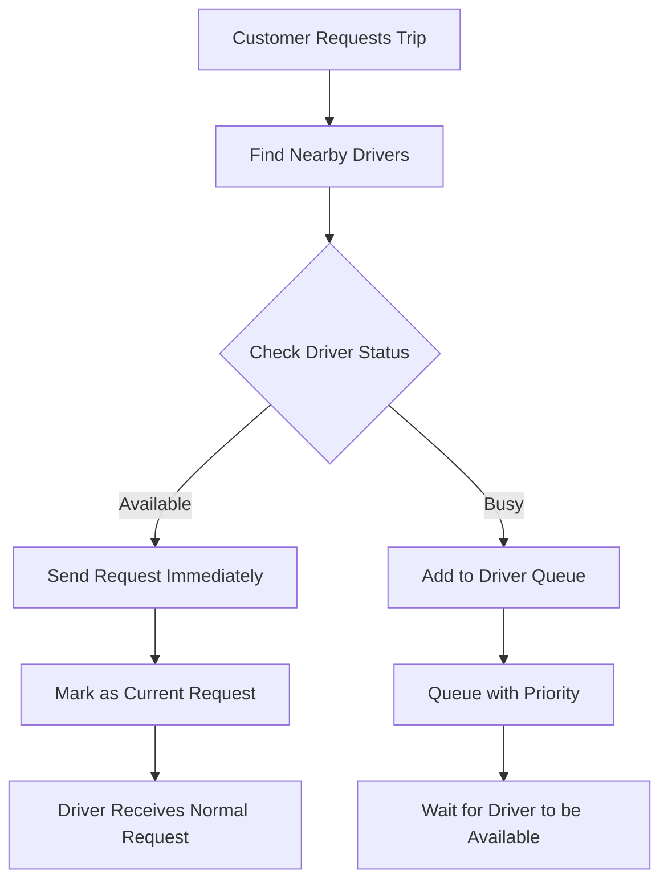
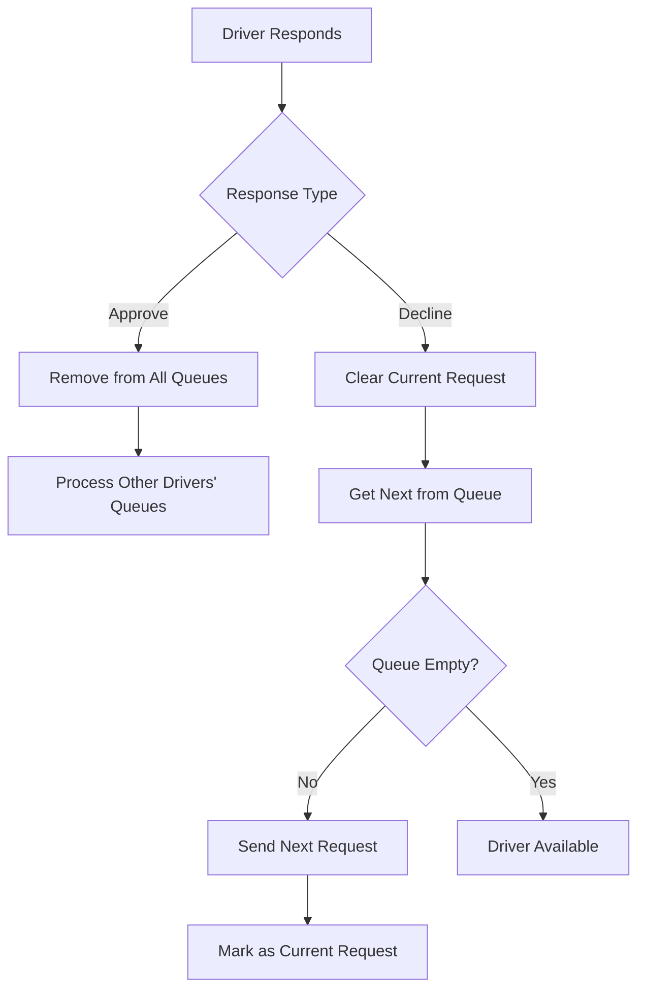
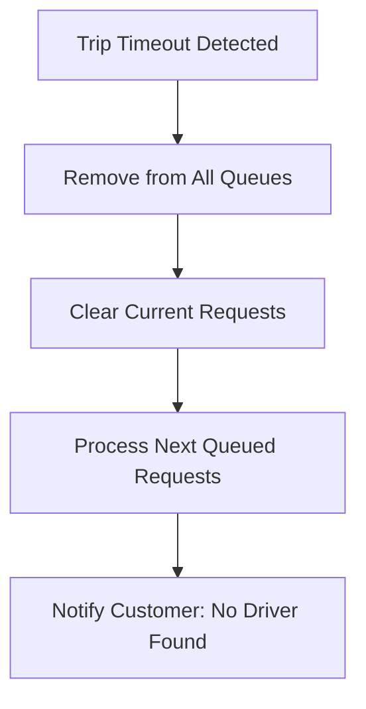

# Driver Request Queue Management System

## Overview

This document describes the transparent queue management system implemented for handling trip requests when drivers are busy. The system ensures that drivers receive trip requests sequentially without overwhelming them with multiple simultaneous requests.

## Key Features

✅ **Transparent to Frontend**: No changes required in driver or customer apps
✅ **Sequential Request Processing**: Drivers receive one request at a time
✅ **Automatic Queue Management**: Busy drivers get requests queued automatically
✅ **Priority Support**: High-priority requests can jump the queue
✅ **Timeout Handling**: Expired requests are cleaned up automatically
✅ **Race Condition Protection**: Redis atomic operations prevent conflicts

## Architecture

### Core Components

1. **DriverRequestQueueService** (`src/redis/services/driver-request-queue.service.ts`)
   - Manages driver request queues in Redis
   - Handles current request tracking
   - Provides queue status and statistics

2. **TripService** (Updated)
   - Enhanced `requestDriver()` method with queue logic
   - Modified `declineTrip()` and `approveTrip()` for queue processing
   - Transparent queue management

3. **TripTimeoutService** (Updated)
   - Queue cleanup on timeout
   - Automatic next request processing

### Redis Data Structure

```typescript
// Driver's current active request
driver:current_request:${driverId} = tripId

// Driver's request queue (sorted set with priority)
driver:request_queue:${driverId} = {
  score: priority_timestamp,
  value: tripId
}

// Trip's queued drivers tracking
trip:queued_drivers:${tripId} = Set[driverId1, driverId2, ...]
```

## How It Works

### 1. Trip Request Flow



### 2. Driver Response Flow



### 3. Timeout Handling



## Implementation Details

### Queue Priority System

- **Priority 1 (High)**: Retry requests, urgent trips
- **Priority 2 (Normal)**: Standard trip requests  
- **Priority 3 (Low)**: Long-distance or low-priority requests

### TTL (Time To Live)

- **Current Request**: 5 minutes (300 seconds)
- **Queue Entries**: 30 minutes (1800 seconds)
- **Automatic Cleanup**: Redis handles expired entries

### Frontend Compatibility

The system is completely transparent to frontend applications:

```typescript
// Driver receives normal trip request event
socket.on('trip_requested', (tripData) => {
  // Same handling as before - no changes needed
  showTripRequestModal(tripData);
});

// Driver responds normally
approveTrip(tripId);  // or declineTrip(tripId)
```

## API Endpoints

### Testing Endpoints

```bash
# Test basic queue functionality
POST /test/queue-system

# Test multi-driver scenarios
POST /test/multi-driver-queue

# Get queue statistics
GET /test/queue-statistics
```

### Example Response

```json
{
  "success": true,
  "results": [
    {
      "test": "Set and get current request",
      "result": "test-trip-456",
      "expected": "test-trip-456",
      "passed": true
    }
  ],
  "message": "All queue tests passed!"
}
```

## Configuration

### Environment Variables

```typescript
// Trip timeout configuration
tripDriverResponseTimeout: 120 // seconds (2 minutes)
```

### Redis Configuration

The system uses the existing Redis configuration from `RedisModule`.

## Monitoring

### Queue Statistics

```typescript
interface QueueStatistics {
  totalActiveRequests: number;
  totalQueuedRequests: number;
  driversWithActiveRequests: number;
  driversWithQueuedRequests: number;
}
```

### Logging

The system provides detailed logging for:
- Queue operations (add, remove, process)
- Driver status changes
- Timeout handling
- Error conditions

## Error Handling

### Graceful Degradation

- Redis connection issues: Falls back to direct notifications
- Invalid trip states: Automatic cleanup and retry
- Driver disconnection: Queue preservation with TTL

### Error Recovery

```typescript
@WithErrorHandling()
async addRequestToDriverQueue(driverId: string, tripId: string) {
  // Automatic error handling with fallback
}
```

## Performance Considerations

### Redis Operations

- **Atomic Operations**: Multi-command transactions prevent race conditions
- **Efficient Lookups**: O(log N) complexity for sorted sets
- **Memory Optimization**: TTL prevents memory leaks

### Scalability

- **Horizontal Scaling**: Redis cluster support
- **Load Distribution**: Queue distribution across drivers
- **Connection Pooling**: Efficient Redis connection management

## Testing

### Unit Tests

```bash
# Test queue system
POST /test/queue-system

# Test multi-driver scenarios  
POST /test/multi-driver-queue
```

### Integration Tests

The system includes comprehensive tests for:
- Basic queue operations
- Multi-driver scenarios
- Timeout handling
- Error conditions

## Deployment

### Prerequisites

- Redis server running
- Existing NestJS application
- MongoDB for trip storage

### Installation

1. The queue system is automatically included in the TripModule
2. No additional configuration required
3. Backward compatible with existing frontend

## Benefits

### For Drivers

- **Reduced Notification Spam**: One request at a time
- **Better User Experience**: No overwhelming multiple requests
- **Fair Distribution**: Queue ensures fair request distribution

### For Customers

- **Improved Response Rates**: Drivers not overwhelmed
- **Faster Matching**: Efficient driver utilization
- **Transparent Experience**: No changes to customer flow

### For System

- **Reduced Load**: Fewer simultaneous notifications
- **Better Analytics**: Queue metrics and monitoring
- **Scalable Architecture**: Handles high request volumes

## Future Enhancements

### Planned Features

1. **Geographic Queuing**: Location-based queue priorities
2. **Driver Preferences**: Queue filtering based on driver preferences
3. **Dynamic Priorities**: AI-based priority adjustment
4. **Queue Analytics**: Advanced metrics and reporting

### Monitoring Dashboard

Future implementation could include:
- Real-time queue visualization
- Driver utilization metrics
- Queue performance analytics
- Alert system for queue issues

## Troubleshooting

### Common Issues

1. **Queue Not Processing**: Check Redis connection
2. **Requests Not Queuing**: Verify driver status service
3. **Memory Issues**: Monitor TTL settings

### Debug Commands

```bash
# Check queue status for driver
GET /test/queue-statistics

# Test queue functionality
POST /test/queue-system
```

## Conclusion

The Driver Request Queue Management System provides a robust, scalable solution for managing trip requests in high-traffic scenarios. The transparent implementation ensures no disruption to existing frontend applications while significantly improving the driver experience and system efficiency.

The system is production-ready and includes comprehensive error handling, monitoring, and testing capabilities.
