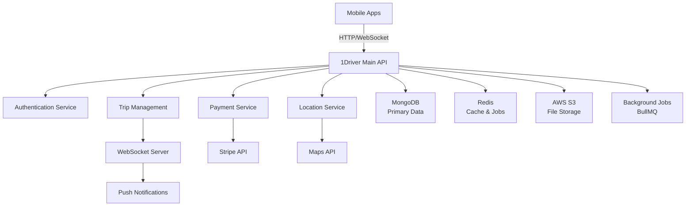
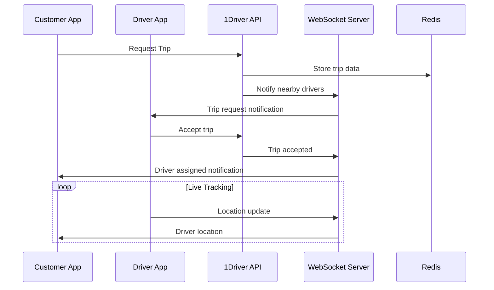

# 1Driver Main API - Enterprise Ride-Hailing Platform

## 📋 Table of Contents
1. [Project Overview](#-project-overview)
2. [Key Features](#-key-features)
3. [Technology Stack](#-technology-stack)
4. [System Architecture](#-system-architecture)
5. [Core Modules](#-core-modules)
6. [Security Features](#-security-features)
7. [API Documentation](#-api-documentation)
8. [Development Setup](#-development-setup)
9. [Production Deployment](#-production-deployment)
10. [Project Structure](#-project-structure)

## 🚗 Project Overview

**1Driver Main API** is a ride-hailing platform that connects customers with drivers for real-time transportation services.

### Core Capabilities
- **Real-time Trip Management**: End-to-end ride lifecycle from request to completion
- **Two-sided Marketplace**: Comprehensive customer and driver management
- **Live Tracking**: WebSocket-based real-time location and trip updates
- **Payment Processing**: Secure payment handling with Stripe integration
- **Document Verification**: Automated driver license and document management
- **Enterprise Security**: Advanced JWT authentication with device binding

## ✨ Key Features

### 🚖 Trip Management
- **Trip Lifecycle**: Request → Driver Matching → Live Tracking → Completion → Payment
- **Smart Driver Assignment**: Intelligent matching based on location and availability
- **Route Optimization**: Integration with mapping services for optimal routes
- **Trip History**: Comprehensive tracking of all ride data
- **Retry Logic**: Automated driver calling with fallback mechanisms

### 👥 User Management
- **Customer Profiles**: Registration, preferences, payment methods, trip history
- **Driver Profiles**: Verification, documents, earnings, performance tracking
- **Authentication**: JWT-based auth with 30-day tokens and device binding
- **Profile Updates**: Email/phone verification with OTP
- **Photo Management**: Profile picture upload and management

### 💰 Payment System
- **Stripe Integration**: Secure payment processing with multiple payment methods
- **Automated Billing**: Trip-based charging with receipt generation
- **Driver Payouts**: Bank account management and earnings distribution
- **Promotional Support**: Discount codes and promotional campaigns

### 📍 Location Services
- **Real-time GPS**: Live driver and customer location tracking
- **Route Planning**: Optimized route calculation and turn-by-turn navigation
- **Geofencing**: Location-based triggers and notifications
- **Address Management**: Customer address book and favorite locations

### 📱 Real-time Communication
- **WebSocket Server**: Bi-directional real-time communication
- **Push Notifications**: Expo SDK and Firebase integration
- **SMS Notifications**: Trip updates and verification codes
- **Status Updates**: Real-time trip status and driver location updates

### 🔒 Security & Compliance
- **Device Binding**: Tokens tied to specific devices for enhanced security
- **Single Session**: Force logout from other devices on new login
- **Real-time Validation**: Continuous token validation on WebSocket connections
- **Audit Logging**: Comprehensive activity tracking and monitoring
- **Data Protection**: Secure handling of sensitive user information

### 🎛️ Operations & Support
- **Support Ticketing**: Customer service and issue resolution system
- **Content Management**: Dynamic content and promotional material management
- **Health Monitoring**: Comprehensive health checks and system monitoring
- **Analytics**: Trip analytics, driver performance, and business metrics

## 🛠️ Technology Stack

### Backend Framework
- **NestJS**: Modern Node.js framework with TypeScript support
- **Fastify**: High-performance web server (chosen over Express for speed)
- **TypeScript**: Type-safe development with modern ES features

### Databases & Storage
- **MongoDB**: Primary database with Mongoose ODM
- **Redis**: Session management, caching, and job queues
- **AWS S3**: File storage for documents and photos

### Real-time & Communication
- **Socket.IO**: WebSocket server with Redis adapter for scaling
- **BullMQ**: Redis-based job queue for background processing
- **Expo SDK**: Push notifications for mobile apps
- **Firebase Admin**: Additional notification services

### Payment & External Services
- **Stripe**: Payment processing and subscription management
- **Maps Integration**: Location and routing services
- **SMS Services**: OTP and notification delivery

### Development & Monitoring
- **Jest**: Testing framework with comprehensive coverage
- **Swagger/OpenAPI**: API documentation
- **Sentry**: Error tracking and performance monitoring
- **Winston**: Structured logging with daily rotation
- **ESLint & Prettier**: Code quality and formatting

### Infrastructure
- **Docker**: Containerization ready
- **PM2**: Process management for production
- **Kubernetes**: Container orchestration support

## 🏗️ System Architecture

### High-Level Architecture


### Core Design Patterns
- **Microservice Architecture**: Modular service design with clear boundaries
- **Event-Driven**: Real-time updates through WebSocket events
- **Queue-Based Processing**: Asynchronous job handling for scalability
- **Repository Pattern**: Data access abstraction
- **Dependency Injection**: Loosely coupled, testable components

### Real-time Communication Flow


## 📦 Core Modules

### 1. Authentication Module (`src/modules/auth/`)
**Purpose**: Secure user authentication and authorization
- JWT token generation with 30-day expiry
- Device binding and single session enforcement
- OTP verification for registration
- Password reset functionality

### 2. Trip Management (`src/modules/trip/`)
**Purpose**: Complete trip lifecycle management
- Trip creation and driver matching
- Real-time status updates
- Route tracking and optimization
- Trip completion and rating system

### 3. Customer Module (`src/modules/customers/`)
**Purpose**: Customer profile and preference management
- User registration and profile updates
- Address management
- Payment method handling
- Trip history and preferences

### 4. Driver Module (`src/modules/drivers/`)
**Purpose**: Driver onboarding and management
- Document verification workflow
- Earnings tracking and bank account management
- Driver status and availability
- Performance metrics and ratings

### 5. Payment Module (`src/modules/payments/`)
**Purpose**: Financial transaction processing
- Stripe payment integration
- Trip billing and receipts
- Driver payout management
- Promotional code handling

### 6. Location Module (`src/modules/location/`)
**Purpose**: GPS and mapping functionality
- Real-time location tracking
- Route calculation and optimization
- Address geocoding and validation
- Geofencing capabilities

### 7. WebSocket Module (`src/websocket/`)
**Purpose**: Real-time bidirectional communication
- Connection management with authentication
- Room-based messaging (user-specific, trip-specific)
- Device tracking and force logout
- Message broadcasting and event handling

### 8. Notification Module (`src/modules/expo-notifications/`)
**Purpose**: Multi-channel notification delivery
- Push notifications via Expo SDK
- SMS notifications for OTP
- Email notifications for important events
- Notification preference management

### 9. Support Module (`src/modules/support-tickets/`)
**Purpose**: Customer service and issue resolution
- Ticket creation and tracking
- Support agent interface
- Issue categorization and routing
- Resolution tracking and feedback

### 10. Queue Module (`src/queue/`)
**Purpose**: Background job processing
- Trip processing workflows
- Notification delivery
- Data synchronization tasks
- Cleanup and maintenance jobs

## 🔐 Security Features

### JWT Authentication with Device Binding
- **30-Day Tokens**: Long-lived tokens for mobile app convenience
- **Device ID Binding**: Tokens tied to specific device identifiers
- **Single Device Policy**: Automatic logout from other devices on new login
- **Token Blacklisting**: Immediate token revocation capability

### WebSocket Security
- **Real-time Token Validation**: Every message validates the JWT token
- **Device Verification**: WebSocket connections verified against device ID
- **Force Logout**: Immediate disconnection of unauthorized devices
- **Connection Tracking**: Monitor and manage active connections

### Data Protection
- **Input Validation**: Comprehensive validation with class-validator
- **SQL Injection Prevention**: Parameterized queries and ODM protection
- **Rate Limiting**: Request throttling to prevent abuse
- **CORS Configuration**: Controlled cross-origin access

### Audit & Monitoring
- **Comprehensive Logging**: Structured logs with request ID tracking
- **Security Events**: Login attempts, token validation failures
- **Error Tracking**: Sentry integration for error monitoring
- **Health Checks**: System health monitoring endpoints

## 📚 API Documentation

### Swagger/OpenAPI Documentation
Access comprehensive API documentation at: `http://localhost:3000/api/docs`

### Health Check Endpoints

#### System Health
```http
GET /api/health
```
Returns overall system status including database connections and service availability.

#### Readiness Check
```http
GET /api/health/ready
```
Indicates if the service is ready to accept traffic.

#### Liveness Check
```http
GET /api/health/live
```
Indicates if the service is running and responsive.

### Authentication
```http
POST /api/auth/customer/signin
POST /api/auth/driver/signin
POST /api/auth/customer/complete-signin
POST /api/auth/driver/complete-signin
```

### Trip Management
```http
POST /api/trip/create
GET /api/trip/:id
PATCH /api/trip/:id/status
GET /api/trip/customer/:customerId
GET /api/trip/driver/:driverId
```

### WebSocket Events

#### Connection Authentication
```javascript
socket.emit('authenticate', {
  token: 'jwt_token',
  deviceId: 'device_identifier'
});
```

#### Trip Events
```javascript
// Customer events
socket.on('trip_request', data => {});
socket.on('driver_assigned', data => {});
socket.on('driver_location', data => {});

// Driver events  
socket.on('trip_offer', data => {});
socket.on('trip_cancelled', data => {});
```

## 🚀 Development Setup

### Prerequisites
- **Node.js**: v18.0.0 or higher
- **MongoDB**: v4.4 or higher
- **Redis**: v6.0 or higher
- **npm**: v8.0.0 or higher

### Installation

1. **Clone the repository**
```bash
git clone <repository-url>
cd 1driver-main-api
```

2. **Install dependencies**
```bash
npm install
```

3. **Setup environment variables**
```bash
cp .env.example .env
# Edit .env with your configuration
```

4. **Start required services**
```bash
# MongoDB (if not using cloud)
mongod

# Redis
redis-server
```

5. **Run the application**
```bash
# Development mode
npm run start:dev

# Debug mode
npm run start:debug

# Production build
npm run build
npm run start:prod
```

### Environment Configuration

#### Database Configuration
```env
MONGODB_URI=mongodb://localhost:27017/1driver
REDIS_URL=redis://localhost:6379
```

#### Authentication
```env
JWT_SECRET=your-super-secret-jwt-key
JWT_EXPIRES_IN=2592000  # 30 days
```

#### External Services
```env
# Stripe
STRIPE_SECRET_KEY=sk_test_...
STRIPE_WEBHOOK_SECRET=whsec_...

# AWS S3
AWS_ACCESS_KEY_ID=your-access-key
AWS_SECRET_ACCESS_KEY=your-secret-key
AWS_BUCKET_NAME=1driver-storage

# Push Notifications
EXPO_ACCESS_TOKEN=your-expo-token
FIREBASE_PROJECT_ID=your-firebase-project
```

#### Server Configuration
```env
PORT=3000
HOST=0.0.0.0
NODE_ENV=development
```

### Testing

```bash
# Unit tests
npm run test

# E2E tests
npm run test:e2e

# Test coverage
npm run test:cov

# Watch mode
npm run test:watch
```

### Code Quality

```bash
# Linting
npm run lint

# Formatting
npm run format
```

## 🌐 Production Deployment

### Docker Deployment

#### Build Docker Image
```bash
docker build -t 1driver-api .
```

#### Run Container
```bash
docker run -p 3000:3000 --env-file .env.production 1driver-api
```

#### Docker Compose
```yaml
version: '3.8'
services:
  app:
    build: .
    ports:
      - "3000:3000"
    environment:
      - NODE_ENV=production
      - MONGODB_URI=mongodb://mongo:27017/1driver
      - REDIS_URL=redis://redis:6379
    depends_on:
      - mongo
      - redis
  
  mongo:
    image: mongo:4.4
    ports:
      - "27017:27017"
    volumes:
      - mongo-data:/data/db
      
  redis:
    image: redis:6.0
    ports:
      - "6379:6379"

volumes:
  mongo-data:
```

### Environment Setup

#### Production Environment Variables
```env
NODE_ENV=production
PORT=3000
HOST=0.0.0.0

# Database
MONGODB_URI=mongodb://production-cluster/1driver
REDIS_URL=redis://production-redis:6379

# Security
JWT_SECRET=production-super-secret-key
JWT_EXPIRES_IN=2592000

# External Services (production keys)
STRIPE_SECRET_KEY=sk_live_...
AWS_ACCESS_KEY_ID=production-key
EXPO_ACCESS_TOKEN=production-token

# Monitoring
SENTRY_DSN=https://your-sentry-dsn
```

### Health Monitoring

The API includes comprehensive health check endpoints for monitoring:

- **`/api/health`**: Overall system health
- **`/api/health/ready`**: Service readiness
- **`/api/health/live`**: Service liveness

### Graceful Shutdown

The application implements graceful shutdown handling:

1. **Signal Handling**: Responds to SIGTERM and SIGINT
2. **Connection Cleanup**: Properly closes WebSocket connections
3. **Database Cleanup**: Closes MongoDB and Redis connections
4. **Queue Cleanup**: Stops background job processing
5. **Timeout**: 30-second maximum shutdown time

### Scaling Considerations

- **Horizontal Scaling**: Stateless design allows multiple instances
- **Redis Adapter**: WebSocket scaling across multiple processes
- **Database Sharding**: MongoDB sharding for large datasets
- **CDN Integration**: AWS S3 + CloudFront for file delivery
- **Load Balancing**: Nginx or AWS ALB for traffic distribution

## 📁 Project Structure

```
1driver-main-api/
 src/                           # Source code
    modules/                   # Feature modules
       auth/                  # Authentication service
       customers/             # Customer management
       drivers/               # Driver management
       trip/                  # Trip lifecycle management
       payments/              # Payment processing
       location/              # Location services
       notifications/         # Notification services
       support-tickets/       # Support system
       health/                # Health check endpoints
   
    websocket/                 # WebSocket server
       websocket.gateway.ts   # WebSocket event handlers
       websocket.service.ts   # WebSocket business logic
       ws-jwt.guard.ts        # WebSocket authentication
   
    clients/                   # External service clients
       auth/                  # Auth client & DTOs
       driver/                # Driver service client
       customer/              # Customer service client
       maps/                  # Maps service integration
   
    jwt/                       # JWT authentication
       jwt.service.ts         # JWT token management
       jwt.guard.ts           # HTTP authentication guard
       logout.guard.ts        # Logout functionality
   
    redis/                     # Redis services
       redis.module.ts        # Redis module configuration
       services/              # Redis-based services
           token-manager.service.ts
           keyspace-event.service.ts
   
    queue/                     # Background job processing
       queue.module.ts        # BullMQ configuration
       services/              # Job processors
   
    s3/                        # AWS S3 integration
       s3.module.ts           # S3 module configuration
       s3.service.ts          # File upload/download
   
    logger/                    # Logging system
       logger.service.ts      # Winston logger service
       request-id.interceptor.ts
       request-logger.middleware.ts
   
    config/                    # Configuration management
       config.module.ts       # Environment configuration
   
    common/                    # Shared utilities
       enums/                 # Shared enumerations
       interfaces/            # Common interfaces
       utils/                 # Utility functions
   
    events/                    # Event handling system
       trip-events.service.ts # Trip-related events
       handlers/              # Event handlers
   
    app.module.ts              # Root application module
    main.ts                    # Application entry point
    instrument.ts              # Sentry instrumentation

 test/                          # Test files
    jest-e2e.json             # E2E test configuration
    app.e2e-spec.ts           # End-to-end tests

 logs/                          # Application logs
 dist/                          # Compiled JavaScript
 node_modules/                  # Dependencies

 .env                           # Environment variables
 .env.example                   # Environment template
 .env.production.example        # Production environment template

 package.json                   # Project dependencies
 tsconfig.json                  # TypeScript configuration
 nest-cli.json                  # NestJS CLI configuration
 dockerfile                     # Docker configuration
 .gitignore                     # Git ignore rules
 .prettierrc                    # Prettier configuration
 eslint.config.mjs              # ESLint configuration

 MOBILE_TOKEN_STRATEGY.md       # Mobile authentication strategy
 GRACEFUL_SHUTDOWN.md           # Shutdown implementation details
 DOCKER-SWARM-SECRETS.md        # Docker Swarm configuration
 README.md                      # This documentation
```

### Module Responsibilities

#### Core Business Logic
- **`modules/auth/`**: User authentication and JWT management
- **`modules/trip/`**: Complete trip lifecycle management
- **`modules/customers/`**: Customer profile and preferences
- **`modules/drivers/`**: Driver onboarding and management
- **`modules/payments/`**: Financial transaction processing

#### Infrastructure Services  
- **`websocket/`**: Real-time bidirectional communication
- **`queue/`**: Background job processing system
- **`redis/`**: Caching and session management
- **`logger/`**: Structured logging system
- **`config/`**: Environment configuration management

#### External Integrations
- **`clients/`**: External service communication
- **`s3/`**: File storage and management
- **`jwt/`**: Authentication token management

#### Supporting Services
- **`modules/notifications/`**: Multi-channel notifications
- **`modules/location/`**: GPS and mapping services
- **`modules/support-tickets/`**: Customer service system
- **`modules/health/`**: System health monitoring

---

**1Driver Main API** provides a comprehensive, production-ready foundation for modern ride-hailing services with enterprise-grade security, real-time capabilities, and scalable architecture.