# Driver API Documentation
## 1Driver Main API - Driver Functionality

### Overview
This document provides comprehensive documentation for all driver-related functionality in the 1Driver main API. Drivers can authenticate, manage profiles, accept trips, track earnings, upload documents, and receive real-time updates through this API.

---

## Table of Contents
1. [Authentication & Account Management](#authentication--account-management)
2. [Driver Profile Management](#driver-profile-management)
3. [Trip Management System](#trip-management-system)
4. [Earnings & Payment System](#earnings--payment-system)
5. [Document Management & Verification](#document-management--verification)
6. [Bank Information Management](#bank-information-management)
7. [Real-time Communication & Location](#real-time-communication--location)
8. [Penalty & Violations System](#penalty--violations-system)
9. [External Services](#external-services)
10. [API Reference](#api-reference)

---

## Authentication & Account Management

### Driver Authentication Flow

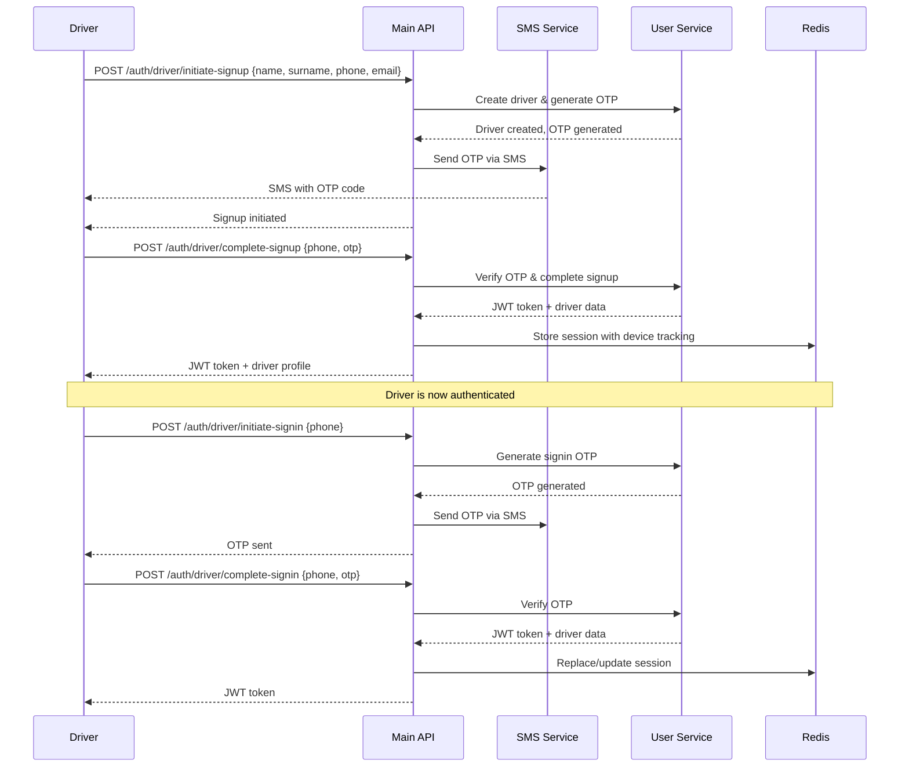

### Endpoints:
- `POST /auth/driver/initiate-signup` - Start driver registration process
- `POST /auth/driver/complete-signup` - Complete registration with OTP
- `POST /auth/driver/initiate-signin` - Request signin OTP
- `POST /auth/driver/complete-signin` - Complete signin with OTP
- `POST /auth/driver/resend-otp` - Resend OTP code
- `POST /auth/driver/logout` - Logout and clear session

### Key Features:
- **OTP-based Authentication**: Secure phone-based verification
- **Device Tracking**: Single active session per driver with device identification
- **Session Management**: Redis-based JWT token management
- **Force Logout**: Automatic logout on new device signin
- **Driver Registration**: Name, surname, phone, and email required

---

## Driver Profile Management

### Profile Management Flow

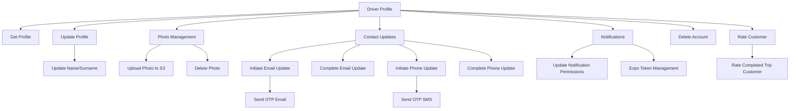

### Endpoints (`/drivers/*`):
- `GET /drivers/me` - Get driver profile
- `PATCH /drivers/me/profile` - Update profile information
- `DELETE /drivers/me` - Delete driver account
- `POST /drivers/initiate-email-update` - Start email update process
- `POST /drivers/complete-email-update` - Complete email update with OTP
- `POST /drivers/initiate-phone-update` - Start phone update process
- `POST /drivers/complete-phone-update` - Complete phone update with OTP
- `POST /drivers/photo` - Upload profile photo
- `DELETE /drivers/photo` - Delete profile photo
- `PATCH /drivers/me/notification-permissions` - Update notification settings
- `PUT /drivers/expo-token` - Set Expo push notification token
- `DELETE /drivers/expo-token` - Remove Expo token
- `PATCH /drivers/:id/rate` - Rate customer after completed trip

### Key Features:
- **Secure Updates**: OTP verification for email/phone changes
- **File Management**: S3 integration for profile photos
- **Notification Control**: Granular notification permissions
- **Push Notifications**: Expo token management for mobile notifications
- **Customer Rating**: Rate customers after trip completion

---

## Trip Management System

### Complete Driver Trip Workflow

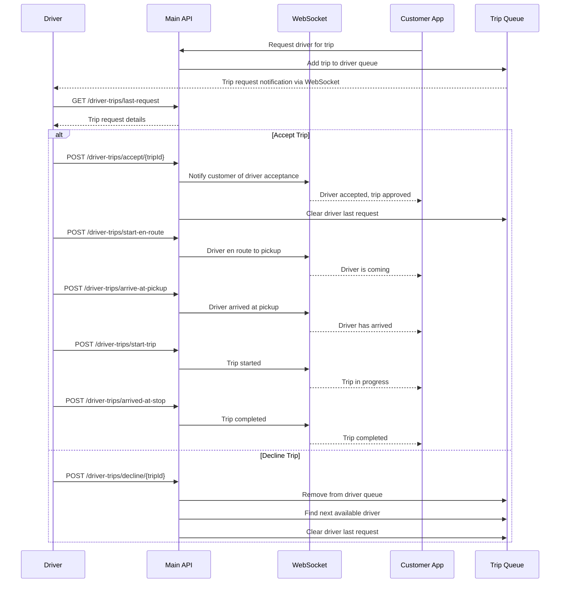

### Trip Status Flow for Drivers

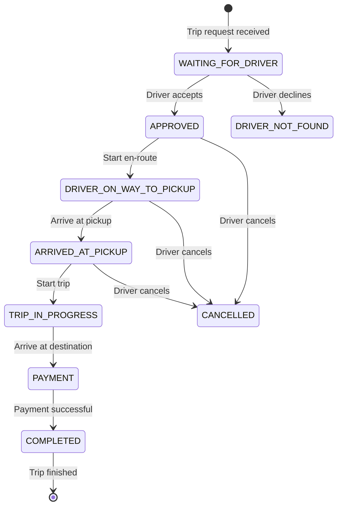

### Endpoints (`/driver-trips/*`):
- `GET /driver-trips/active` - Get current active trip
- `GET /driver-trips/last-request` - Get last trip request
- `POST /driver-trips/accept/:tripId` - Accept trip request
- `POST /driver-trips/decline/:tripId` - Decline trip request
- `POST /driver-trips/start-en-route` - Start driving to pickup location
- `POST /driver-trips/arrive-at-pickup` - Mark arrival at pickup
- `POST /driver-trips/start-trip` - Start the trip (customer in vehicle)
- `POST /driver-trips/arrived-at-stop` - Complete trip at destination
- `POST /driver-trips/cancel` - Cancel trip as driver
- `GET /driver-trips/statistics` - Get driver trip statistics
- `GET /driver-trips/history` - Get trip history (paginated)
- `GET /driver-trips/:id` - Get specific trip details
- `PATCH /driver-trips/:id/rate` - Rate completed trip customer
- `POST /driver-trips/:id/comment` - Add comment to trip

### Key Features:
- **Real-time Trip Queue**: Automatic trip request distribution
- **Trip Status Management**: Complete trip lifecycle control
- **Trip History**: Comprehensive trip record keeping
- **Statistics**: Driver performance metrics and analytics
- **Customer Rating**: Rate customers after trip completion
- **Trip Comments**: Add notes to completed trips

---

## Earnings & Payment System

### Driver Earnings Flow

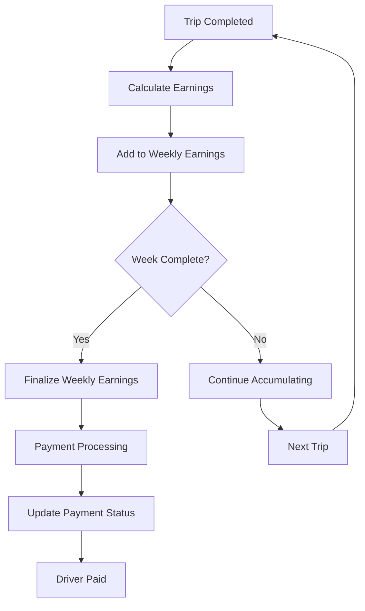

### Weekly Earnings System

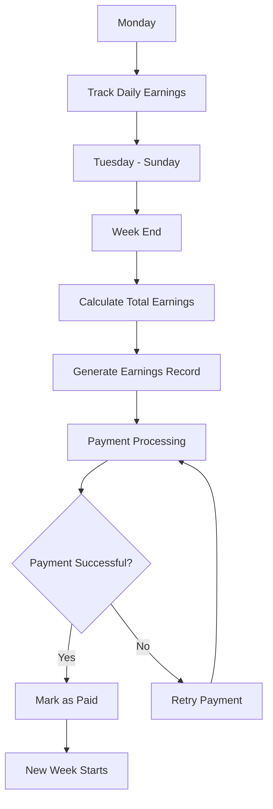

### Endpoints:
**Driver Earnings (`/drivers/earnings/*`)**:
- `GET /drivers/earnings` - Get all earnings with pagination
- `GET /drivers/earnings/:id` - Get specific earnings details

### Key Features:
- **Weekly Earnings**: Automatic weekly earnings calculation
- **Trip Tracking**: Individual trip earnings within weekly periods
- **Payment Status**: Track payment processing and completion
- **Earnings History**: Comprehensive earnings record with pagination
- **Earnings Details**: Detailed breakdown by trips and multipliers

---

## Document Management & Verification

### Document Upload & Verification Flow

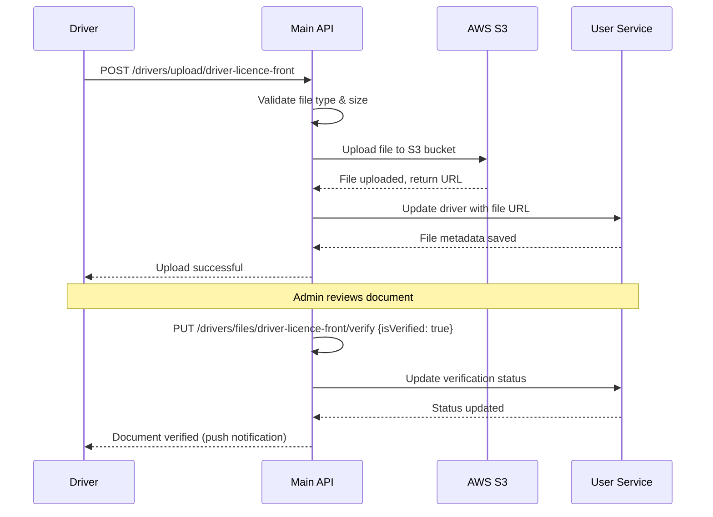

### Document Types & Requirements

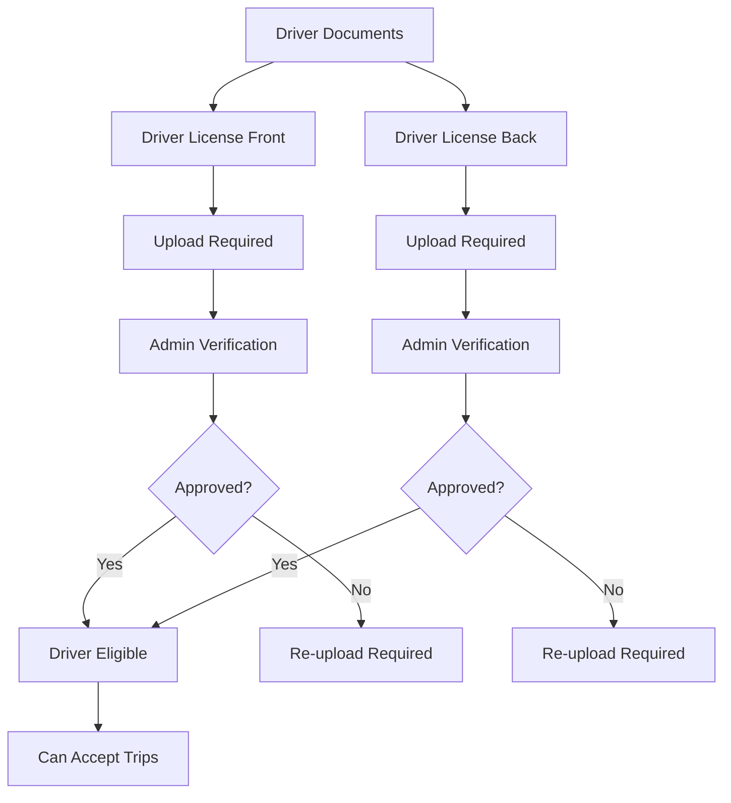

### Endpoints (`/drivers/*`):
- `POST /drivers/upload/:fileType` - Upload document file
- `DELETE /drivers/files/:fileType` - Delete uploaded document
- `PUT /drivers/files/:fileType/verify` - Verify document (admin only)

### Supported File Types:
- `DRIVERS_LICENSE_FRONT` - Front side of driver license
- `DRIVERS_LICENSE_BACK` - Back side of driver license

### Key Features:
- **S3 Integration**: Secure file storage with unique keys
- **File Validation**: Type and size validation
- **Verification System**: Admin-controlled document approval
- **Replace Functionality**: Automatic old file cleanup when uploading new
- **Document Status**: Track verification status per document

---

## Bank Information Management

### Bank Account Management Flow

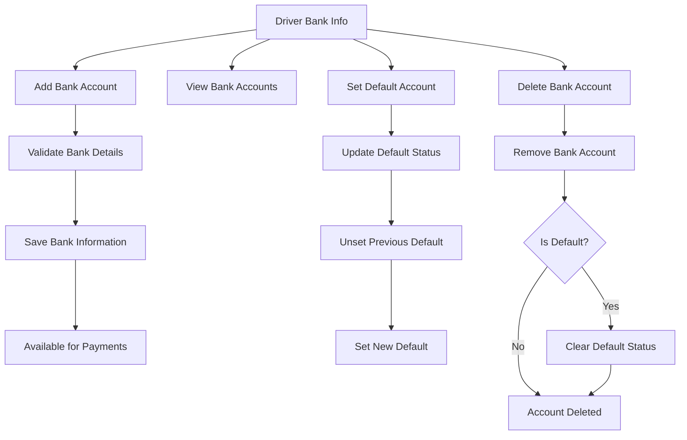

### Endpoints (`/drivers/bank-info/*`):
- `POST /drivers/bank-info` - Add new bank information
- `GET /drivers/bank-info` - Get all bank information
- `DELETE /drivers/bank-info/:bankInfoId` - Delete bank information
- `PUT /drivers/bank-info/:bankInfoId/set-default` - Set default bank account

### Key Features:
- **Multiple Bank Accounts**: Support for multiple bank accounts
- **Default Account**: Set preferred account for payments
- **Account Validation**: Bank account details validation
- **Secure Storage**: Encrypted bank information storage

---

## Real-time Communication & Location

### WebSocket Connection & Location Updates

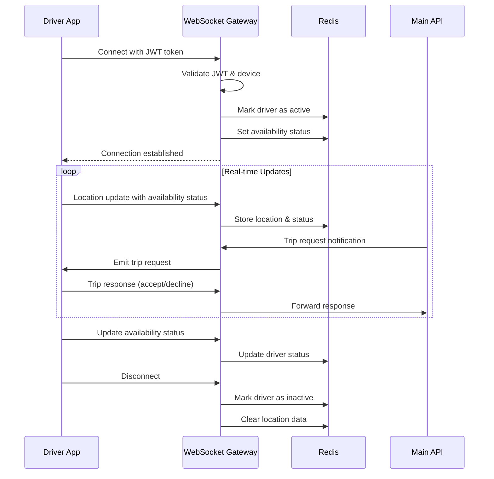

### Driver Availability States

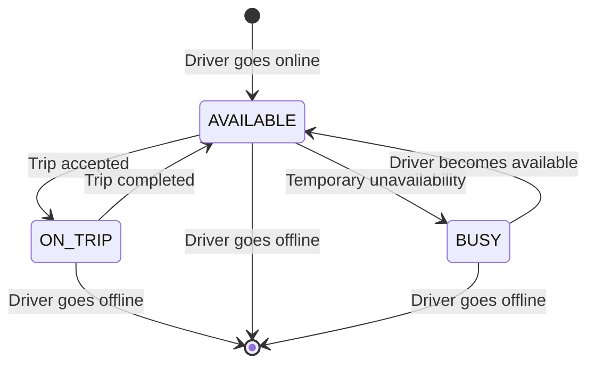

### Location & Status Management:
- **Real-time Location**: Continuous location tracking during availability
- **Availability Status**: Three states - Available, Busy, On Trip
- **Trip Notifications**: Real-time trip request notifications
- **Location History**: Track driver movement during trips
- **Offline Detection**: Automatic status updates when driver disconnects

### Key Features:
- **Real-time Updates**: WebSocket for instant location and status updates
- **Trip Queue Integration**: Automatic trip request distribution to available drivers
- **Status Management**: Driver availability control
- **Location Tracking**: GPS location updates with status information
- **Connection Management**: Handle disconnections and reconnections gracefully

---

## Penalty & Violations System

### Driver Penalty Management

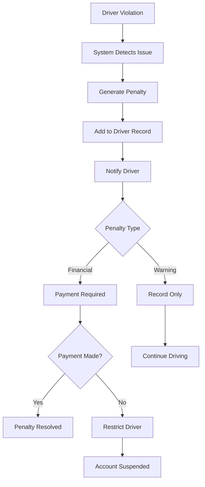

### Endpoints (`/driver-penalties/*`):
- `GET /driver-penalties` - Get all driver penalties
- `GET /driver-penalties/unpaid` - Get unpaid penalties

### Key Features:
- **Penalty Tracking**: Comprehensive violation record keeping
- **Payment Integration**: Financial penalties with payment tracking
- **Account Restrictions**: Automatic restrictions for unpaid penalties
- **Penalty History**: Complete penalty history for drivers

---

## External Services

### Service Integration Map

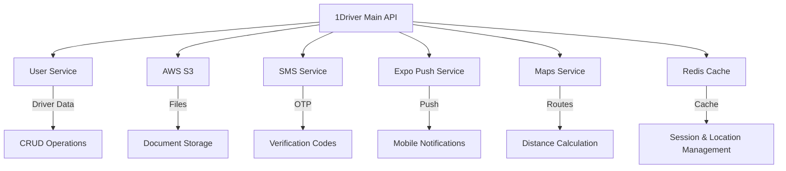

### External Services Used:

1. **AWS S3 Storage**
   - Profile photo storage
   - Document storage (driver licenses)
   - Secure file upload/download

2. **SMS Service**
   - OTP delivery for authentication
   - Phone verification for updates

3. **Expo Push Notifications**
   - Mobile app notifications
   - Trip request notifications
   - Real-time alerts

4. **Maps Service**
   - Route calculation for trips
   - Distance and duration estimation

5. **Redis Cache**
   - Session management
   - Real-time location storage
   - WebSocket connection tracking
   - Trip queue management

6. **External User Service**
   - Driver profile storage
   - Authentication management
   - Document verification status

---

## API Reference

### Authentication Headers
```
Authorization: Bearer <JWT_TOKEN>
Content-Type: application/json
x-device-id: <DEVICE_ID>
```

### Common Request/Response Examples

#### Driver Signup
```json
POST /auth/driver/initiate-signup
{
  "name": "John",
  "surname": "Doe",
  "phone": "+1234567890",
  "email": "john.doe@example.com",
  "expoToken": "ExponentPushToken[xxxxxxxxxxxxxxxxxxxxxx]"
}

Response:
{
  "success": true,
  "message": "OTP sent to phone number"
}
```

#### Trip Acceptance
```json
POST /driver-trips/accept/trip_123
{}

Response:
{
  "success": true,
  "message": "Trip accepted successfully",
  "trip": {
    "tripId": "trip_123",
    "customerId": "cust_456",
    "origin": {
      "lat": 40.7128,
      "lon": -74.0060,
      "address": "New York, NY"
    },
    "destination": {
      "lat": 40.7589,
      "lon": -73.9851,
      "address": "Times Square, NY"
    },
    "fare": 1500,
    "status": "APPROVED"
  }
}
```

#### Bank Information Setup
```json
POST /drivers/bank-info
{
  "bankName": "Chase Bank",
  "accountNumber": "1234567890",
  "routingNumber": "021000021",
  "accountHolderName": "John Doe"
}

Response:
{
  "success": true,
  "message": "Bank information added successfully",
  "bankInfo": {
    "id": "bank_123",
    "bankName": "Chase Bank",
    "accountNumber": "****7890",
    "isDefault": false
  }
}
```

#### Document Upload
```json
POST /drivers/upload/driver-licence-front
Content-Type: multipart/form-data

file: [binary data]

Response:
{
  "message": "File uploaded successfully",
  "fileKey": "userId123/driver-licence-front/uuid-filename.jpg",
  "fileType": "driver-licence-front",
  "fileUrl": "https://s3.amazonaws.com/bucket/key"
}
```

### Error Responses
```json
{
  "error": {
    "code": "VALIDATION_ERROR",
    "message": "Invalid phone number format",
    "details": {
      "field": "phone",
      "value": "invalid_phone"
    }
  }
}
```

---

## Driver Capabilities Summary

### What drivers can do with these APIs:

1. **Account Management**
   - Register and authenticate securely with OTP
   - Manage profile information and preferences
   - Update contact information with verification
   - Upload and manage profile photos
   - Delete account when needed

2. **Trip Management**
   - Receive real-time trip requests
   - Accept or decline trip requests
   - Manage complete trip lifecycle from pickup to completion
   - View trip history and statistics
   - Rate customers after trip completion
   - Add comments to completed trips

3. **Earnings & Payments**
   - Track weekly earnings automatically
   - View detailed earnings history
   - Monitor payment status and processing
   - Access earnings statistics and reports

4. **Document Management**
   - Upload driver license documents to secure storage
   - Track document verification status
   - Replace documents when needed
   - Ensure compliance with platform requirements

5. **Banking & Payments**
   - Add multiple bank accounts for payments
   - Set default payment account
   - Manage bank information securely
   - Receive weekly payments to chosen account

6. **Real-time Experience**
   - Share location in real-time while available
   - Manage availability status (available/busy/on_trip)
   - Receive instant trip notifications
   - Communicate via push notifications
   - Handle real-time trip status updates

7. **Penalty & Compliance**
   - View penalty history and status
   - Track unpaid penalties
   - Maintain account compliance
   - Resolve violations promptly

This comprehensive API enables drivers to have a complete ride-sharing experience from registration to earning management with real-time trip handling, document verification, and secure payment processing.